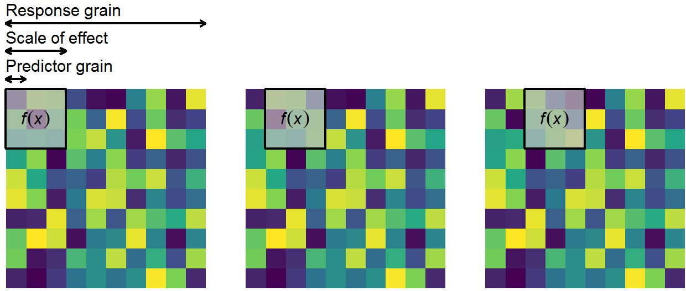

```{r setup, include=FALSE}
options(htmltools.dir.version = FALSE)
knitr::opts_chunk$set(echo = FALSE, message = FALSE, warning = FALSE)

# libraries
library(tidyverse)
library(sf)
library(knitr)
library(jtools)
library(cowplot)

theme_set(theme_bw(base_size = 18) + theme(strip.background = element_blank(), 
                             panel.grid.major = element_blank(),
                             panel.grid.minor = element_blank()))
# define logit and inv logit functions
logit <- function(value, eps) {
  log((value + eps)/(1 - value + eps))  
}

inv.logit <- function(value, eps) {
  eps <- (1-2*eps)  
  (eps*(1+exp(value))+(exp(value)-1))/(2*eps*(1+exp(value)))
}

# labelling
varorder <- c("index10", "winshannon", "lsshannon", "habitat", "urban", "bio1")

varlabel <- c("Abundance (2010 Atlas)", "MW Shannon\n(1km)", "LS Shannon", 
              "Forest %", "Urban %", "Temperature")

coefforder <- c("(Intercept)", "winshannon", "lsshannon", "habitat", 
               "winshannon:bio1", "lsshannon:bio1",
               "urban", "bio1")

coefflabel <- c("Intercept", "MW Shannon (1km)", "LS Shannon", "Forest %", 
                    "MW Shannon : Temperature", "LS Shannon : Temperature", 
                    "Urban %", "Temperature")

# load data
load("results/jays_covariates.Rda")
jay_sp <- jay_sp %>% filter(index10 != 0) %>% na.omit
jay_df <- jay_sp %>% as.tibble %>% select(varorder) %>% mutate(bio1 = bio1/10)

# transform data
# smallest relative abundance
eps <- min(jay_df$index10)
jay_df_t <- mutate(jay_df, 
                   index10logit = logit(index10, eps))

jay_narrow_t <- gather(jay_df_t, variable, value) %>% 
  mutate(variable = factor(variable, 
         levels = varorder, labels = varlabel))

# get mean and sd values from the transformed data for back-scaling
means <- jay_df_t %>% 
  summarise_all(funs(mean, sd)) %>% 
  gather() %>% 
  separate(key, into=c("covariate", "measure")) %>% 
  spread(measure, value)

scale_this <- function(x) as.vector(scale(x))
jay_df_t <- mutate_at(jay_df_t, .vars = vars(-index10logit, -index10), .funs = funs(scale_this))
```

class: center, middle

# How do climate and land-use change interactively affect ecological processes?

---

# Two key problems

--

<br/>

Conceptual

- The scale at which drivers affect responses varies
- As does the resolution at which broad-scale patterns of ecological processes emerges

<br/>

--

Data

- The scale we measure this stuff at varies too
- Ecological response (e.g. species richness) often available at coarse resolutions

---

# Combining data at different scales

- Need to aggregate fine-scale data to coarse resolutions without losing information about within-unit variation

--

- Using a moving window to calculate heterogeneity before aggregating retains information about spatial structure at an appropriate scale

--

.center[]

---


# Case study: Abundance of Eurasian Jay

.pull-left[

```{r}
jay_response <- jay_sp %>% 
  mutate_at(.vars = vars(-index10, -geometry), .funs = funs(scale)) %>% 
  gather(variable, value, -geometry) %>% 
  mutate(facet = "Relative abundance index")

ggplot(jay_response %>% filter(variable == "index10")) + 
  geom_sf(aes(fill = value), colour = NA) +
  coord_sf(crs = st_crs(jay_response), datum = NA) + 
  scale_fill_viridis_c(name = "", 
                       option = "magma", 
                       breaks = seq(0, 1, by = 0.25), 
                       labels = seq(0, 1, by = 0.25)) + 
  theme(axis.text = element_blank(), axis.line = element_blank(), 
        axis.ticks = element_blank(),
        legend.position = "bottom", legend.title.align = 0.5,
        legend.key.height=unit(6,"points"), legend.key.width = unit(1.5, "line"),
        panel.border = element_blank())

```

Source: BTO Atlas 2007--2011

]

.pull-right[

.center[]

]

---

# Case study: Abundance of Eurasian Jay

.center[

Abundance ~ MW Shannon + LS Shannon + % Forest + % Urban + Temperature + Temperature x MW Shannon + Temperature x LS Shannon

```{r}
mod_global <- lm(index10logit ~ winshannon + lsshannon + habitat + urban + bio1 +
                   bio1:lsshannon + bio1:winshannon, 
                 data = jay_df_t, na.action = na.fail)

source("R/ca_glm.R")

calc_commonality(mod_global)$CCTotalbyVar %>% 
               as.tibble(rownames = "variable") %>%
  mutate(fvariable = factor(variable, levels = coefforder, labels = coefflabel)) %>%
  select(Covariate = fvariable, Unique, Common, Total) %>% 
  arrange(Covariate) %>% 
  kable(digits = 3, 'html')
```
]

---

# Case study: Abundance of Eurasian Jay
.center[

Abundance ~ MW Shannon + % Urban + Temperature + Temperature x MW Shannon

```{r, fig.width = 15, fig.height = 8}
mod_mw <- lm(index10logit ~ urban + winshannon * bio1, 
                 data = jay_df_t, na.action = na.fail)

pred_vals <- bind_rows(
  make_predictions(mod_mw, pred = "urban", interval = TRUE)$predicted %>% 
    select(index10logit, ymax, ymin, pred = urban) %>% 
    mutate(covariate = "urban"),
  make_predictions(mod_mw, pred = "bio1", modx = "winshannon", interval = TRUE)$predicted %>% 
    select(index10logit, ymax, ymin, modx_group, pred = bio1) %>% 
    mutate(covariate = "bio1", modx = "winshannon"),
  make_predictions(mod_mw, pred = "winshannon", modx = "bio1", interval = TRUE)$predicted %>%
    select(index10logit, ymax, ymin, modx_group, pred = winshannon) %>% 
    mutate(covariate = "winshannon", modx = "bio1")) %>% 
  as.tibble %>% 
  mutate_at(c("index10logit", "ymin", "ymax"), inv.logit, eps) %>% 
  left_join(means) %>% 
  left_join(means, by = c("modx" = "covariate"), suffix = c("_pred", "_modx")) %>% 
  mutate(pred = pred*sd_pred + mean_pred,
         modx_value = case_when(modx_group == "- 1 SD" ~ mean_modx - sd_modx, 
                                modx_group == "Mean" ~ mean_modx,
                                modx_group == "+ 1 SD" ~ mean_modx + sd_modx,
                                TRUE ~ 0),
         modx_label = factor(paste0(modx_group, " (", round(modx_value, 2), ")")),
         modx_label = fct_reorder(modx_label, modx_value))

# plot the results
ggplot(pred_vals %>% filter(covariate == "winshannon"), 
                     aes(x = pred, y = index10logit, group = modx_label)) + 
  geom_line(aes(lty = modx_label)) + 
  scale_linetype_manual(name = expression("Temperature (" * degree * "C)"), 
                        values = c("dashed", "solid", "dotdash")) + 
  scale_y_continuous(limits = c(0, 1), breaks = c(0, 0.25, 0.5, 0.75, 1)) + 
  geom_ribbon(aes(ymin = ymin, ymax = ymax), alpha = 0.2) + 
  theme(legend.position = c(0.1, 0.9), legend.key.height = unit(0.1, "line")) + 
  labs(x = "MW Shannon (1km)", 
       y = expression("Eurasian jay abundance index ("%+-% "95% CI)"))
```
]

---

# Conclusions

- *Case study*: Importance of habitat evenness at local scales increases with increasing temperatures

--

- Moving window approach to data-aggregation provides stronger information (in this case) than traditional aggregation measures

--

- We can combine data that vary and/or are measured at different spatial resolutions

--

- Method has broader utility beyond spatial ecology

  - Combining conflicting temporal resolutions
  - Broad range of research areas such as social sciences; geology; agricultural sciences
  
--

- Available as `grainchanger` R package [https://github.com/laurajanegraham/grainchanger](https://github.com/laurajanegraham/grainchanger)