# Upscaling: Forest Case Study
Laura Graham  


## Required packages

In the first step, we load all of the required packages. Note that winmoveR (the package developed for this paper) can be installed using `devtools::install_github("laurajanegraham/winmoveR")`

The development version of ggplot2 is required for the spatial plots. Install using `devtools::install_github("tidyverse/ggplot2")`

Other options in this section set the order and labels for the variables for plotting and tables. 


```r
library(MASS)
library(winmoveR)
library(raster)
library(rgdal)
library(rgeos)
library(cowplot)
library(sf)
library(knitr)
library(GGally)
library(e1071) # optimising transformations (skewness function)
library(broom)
library(MuMIn)
library(stringr)
library(DHARMa)
library(tidyverse)


# set up plotting options
theme_set(theme_classic() + theme(strip.background = element_blank()))

varorder <- c("sprich", "winvar2000", "elevvar", "elevmean", "bio1", "bio12", "bio15")

varlabel <- c("Species richness", "MW Elevation (2km)", "LS Elevation", "Mean Elevation", "Temperature", "Precipitation", "Precip. seasonality")

coefforder <- c("(Intercept)", "winvar2000", "elevvar", "elevmean", "elevmean:winvar2000", "elevmean:elevvar", "bio1", "bio12", "bio15", "I(bio1^2)", "I(bio12^2)")

coefflabel <- c("(Intercept)", "MW elevation", "LS elevation", "Mean elevation", "Mean elevation : MW elevation", "Mean elevation : LS elevation", "Temperature", "Precipitation", "Precipitation\nseasonality", "Temperature\n(quadratic)", "Precipitation\n(quadratic)")
```

# Data

## EU forest data

First we need to load in and spatialise the EU forest data: available for download from [figshare](https://ndownloader.figshare.com/files/6662535)


```r
# we only need this step the first time - once combined with the environmental
# data the output is saved to results/forests_covariates_sp.Rda for further use
forests <- read_csv("~/DATA/BIOLOGICAL/eu_forests/eu_forest_species.csv") %>% 
  mutate(sp_name = `SPECIES NAME`) %>% 
  dplyr::select(X, Y, sp_name)

forests <- SpatialPointsDataFrame(forests[,1:2], forests[,3], proj4string = crs("+proj=laea +lat_0=52 +lon_0=10 +x_0=4321000 +y_0=3210000 +ellps=GRS80 +units=m +no_defs"))
```

## Environmental data

Analyses will be at 0.5 degree resolution. The data to be upscaled are the elevation data from the [European Environment Agency](https://www.eea.europa.eu/data-and-maps/data/eu-dem). By cropping all datasets to the extent of the EU elevation data, we end up losing some of the data from the EU forest dataset, such as the records from Northern Africa and the Canaries. We aggregate the elevation to 100m (from 25m) for ease of computation.

We will use the moving window to upscale the variation in elevation using a radius of 2km. We will also calculate variation in elevation at 0.5 degree resolution. As covariates, we  calculated average temperature and precipitation at 0.5 degree resolution. 


```r
# This section only gets run the first time (or if changed) and the output saved
# to file. Set eval = FALSE at all other times.

# get climate data
wc_bio <- getData('worldclim', var = "bio", res = 10, path = "~/DATA/CLIMATE/worldclim/")
wc_bio_30 <- aggregate(wc_bio, fact = 3)

# load in the elevation data
elev <- raster("~/DATA/PHYSICAL/elev/eu_dem/eudem_dem_3035_europe.tif")


# get forest and climate data in same projection as elev and crop worldclim data by the EU forest dataset
forests <- spTransform(forests, crs(elev))
wc_bio_30 <- projectRaster(wc_bio_30, crs = crs(elev))

# crop climate data
bounds <- extent(elev) 
wc_bio_eu <- crop(wc_bio_30, bounds)

# rasterise the EU forest data to create total species richness (the input function gets the total number of unique species in a cell)
forests_r <- rasterize(forests, wc_bio_eu, fun=function(x, ...){ length(unique(na.omit(x)))})[[2]]

# create a grid for the moving window and elevation aggregation to loop through - I want to move this into the package at some point
eu_grid <- as(forests_r, 'SpatialPolygonsDataFrame')

agg_cell <- function(grid, dat, cell_no, fact, fn="mean", ...) {
  cell <- grid[cell_no,]
  dat_cell <- crop(dat, cell, filename='temp_raster/temp_crop.tif', overwrite=TRUE)
  dat_cell_agg <- aggregate(dat_cell, fact, fun = fn,
                            filename='temp_raster/temp_agg.tif', overwrite=TRUE)
  zero_to_na <- function(x) ifelse(x==0, NA, x)
  dat_cell_na <- raster::calc(dat_cell_agg, zero_to_na, ...)
}

elev_cell_100 <- list()

for(cell_no in 1:length(eu_grid)) {
  elev_cell_100[[cell_no]] <- agg_cell(eu_grid, elev, cell_no, 4, filename=paste0('temp_raster/temp_agg_', cell_no, '.tif'), overwrite=TRUE)
}

# need to add the arguments to mosaic as attributes of the raster list.
rasters.mosaicargs <- elev_cell_100
names(rasters.mosaicargs) <- NULL
rasters.mosaicargs$fun <- mean
rasters.mosaicargs$filename <- '~/DATA/PHYSICAL/elev/eu_dem/eudem_100m_aggregated.tif'
rasters.mosaicargs$overwrite <- TRUE
rasters.mosaicargs$na.rm <- TRUE

elev_100 <- do.call("mosaic", rasters.mosaicargs)

# create the grid level covariates
eu_grid$elevvar <- nomove_upscale(grid = eu_grid, dat = elev_100, fn = "var", na.rm = TRUE)

eu_grid$elevmean <- nomove_upscale(grid = eu_grid, dat = elev_100, fn = "mean", na.rm = TRUE)

# upscale the eu elevation data using the moving window approach
strt <- Sys.time()
eu_grid$winvar2000 <- winmove_upscale(eu_grid, elev_100, 2000, 
                                        "rectangle", "var")
run_time <- difftime(Sys.time(), strt, units = "mins")

save(run_time, file = "results/forest_runtime.Rda")

forests_pts <- spTransform(gCentroid(eu_grid, byid=TRUE), crs(elev))

forests_sp <- st_as_sf(eu_grid) %>% 
  bind_cols(raster::extract(wc_bio_eu, forests_pts) %>% as.tibble) %>% 
  rename(sprich = sp_name)

save(forests_sp, file="results/forests_covariates_sp.Rda")
```


Upscaling 100m resolution elevation data for Europe to 0.5 degree resolution using a 2km radius window took:  288.59 minutes. 

## Exploration and transformation

What do the variables look like spatially?


```r
load("results/forests_covariates_sp.Rda")
forests_narrow <- forests_sp %>% 
  select(varorder) %>% 
  mutate_at(.vars = vars(-sprich, -geometry), .funs = funs(scale)) %>% 
  gather(variable, value, -geometry) %>% 
  mutate(facet = "Tree species richness") %>% na.omit

sp_plot <- ggplot(forests_narrow %>% filter(variable == "sprich")) + 
  geom_sf(aes(fill = value), colour = NA) +
  coord_sf(crs = st_crs(forests_narrow), datum = NA) + 
  scale_fill_viridis_c(name = "", option = "magma") + 
  facet_wrap(~facet) + 
  theme(axis.text = element_blank(), axis.line = element_blank(), axis.ticks = element_blank(),
        legend.position = "bottom", legend.title.align = 0.5,
        legend.key.height=unit(6,"points"), legend.key.width = unit(1.5, "line"))

covs <- forests_narrow %>% 
  filter(variable %in% varorder[-1]) %>% 
  mutate(variable = factor(variable, levels = varorder, labels = varlabel))

cov_plot <- ggplot(covs) + 
  geom_sf(aes(fill = value), colour = NA) +
  coord_sf(crs = st_crs(forests_narrow), datum = NA) + 
  scale_fill_viridis_c(name = "") + facet_wrap(~variable) + 
  theme(axis.text = element_blank(), axis.line = element_blank(), axis.ticks = element_blank(),
        legend.position = "bottom", legend.title.align = 0.5,
        legend.key.height=unit(6,"points"), legend.key.width = unit(2, "line"))

spatial_plot <- plot_grid(sp_plot, cov_plot, labels = c("a)", "b)"),
                          label_size = 10, rel_widths = c(1, 1.4))

save(spatial_plot, file = "results/forest_spatial.Rda")

spatial_plot
```

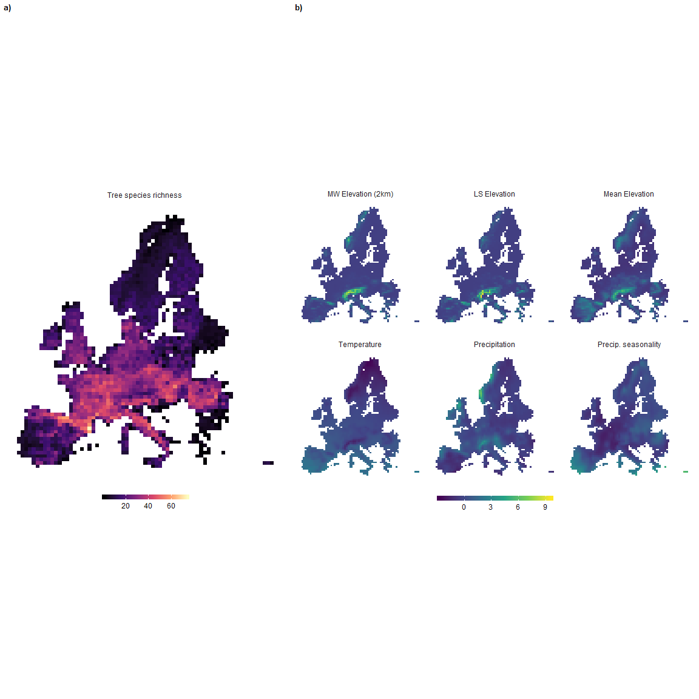<!-- -->

How are the variables distributed and where are the correlations?


```r
forests_df <- forests_sp %>% as.tibble %>% select(varorder) %>% na.omit

ggpairs(
  forests_df %>% select(varorder), 
  upper = list(
    continuous = wrap('cor', method = "spearman")
  ),
  columnLabels = varlabel
)
```

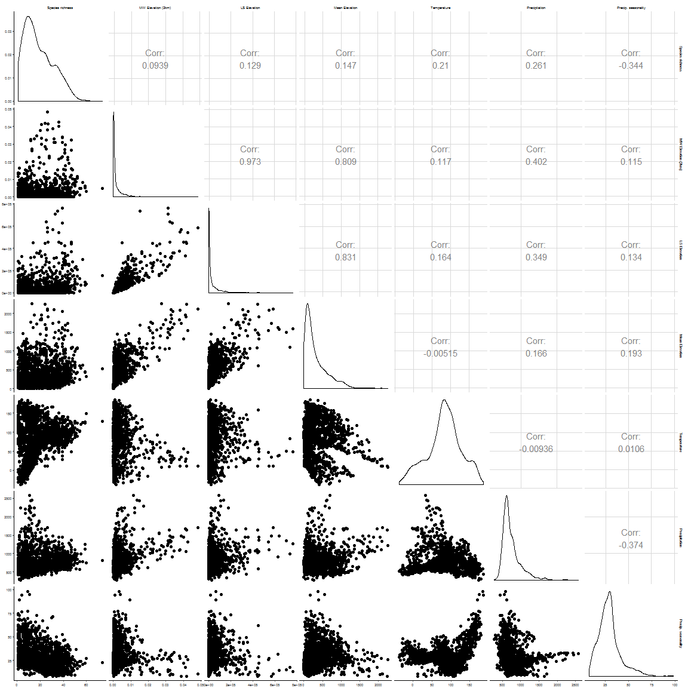<!-- -->

MW Elevation is the lowest correlation except for total precipitation (bio12). Highest correlation is with precipitation seasonality (bio15). Our expectation that variation in elevation would be important is supported here by the fact that the species richness correlation with mean elevation is lower. Species richness ideal for Poisson distribution; right skew to MW Elevation and LS elevation, Mean elevation, as well as the precipitation variables - need to transform. 


```r
# optimise to find optimal value for log transform
skew.score <- function(c, x) (skewness(log(x + c)))^2
c.winvar2000 <- optimise(skew.score, c(0, 20), x = forests_df$winvar2000)$minimum
c.elevvar <- optimise(skew.score, c(0, 20), x = forests_df$elevvar)$minimum
c.elevmean <- optimise(skew.score, c(0, 20), x = forests_df$elevmean)$minimum
c.bio12 <- optimise(skew.score, c(0, 20), x = forests_df$bio12)$minimum
c.bio15 <- optimise(skew.score, c(0, 20), x = forests_df$bio15)$minimum


forests_df_t <- select(forests_df, varorder) %>% 
  mutate(winvar2000 = log(winvar2000 + c.winvar2000),
         elevvar = log(elevvar + c.elevvar),
         elevmean = log(elevmean + c.elevmean),
         bio12 = log(bio12 + c.bio12),
         bio15 = log(bio15 + c.bio15))

forests_narrow_t <- gather(forests_df_t, variable, value) %>% 
  mutate(variable = factor(variable, levels = varorder, labels = varlabel))

ggplot(forests_narrow_t, aes(x = value)) + 
  geom_histogram(bins = 30) + 
  facet_wrap(~variable, scales = "free_x")
```

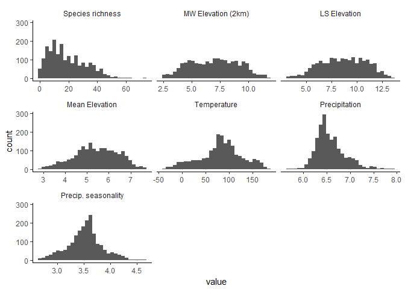<!-- -->

We scaled the data (mean = 0, sd = 1) so that the partial regression coefficients are comparable. 


```r
scale_this <- function(x) as.vector(scale(x))
forests_df_t <- mutate_at(forests_df_t, .vars = vars(-sprich), .funs = funs(scale_this))
```

# Models

## Global model

We are including the quadratic term for temperature (bio1) and precipitation (bio12), due to the shape of the relationship between these variables (and based on some earlier residual diagnostics)


```r
mod_global <- glm.nb(sprich ~ elevmean + winvar2000 + elevvar + elevmean:winvar2000 + elevmean:elevvar + bio1 + I(bio1^2) + bio12 + I(bio12^2) + bio15, data = forests_df_t, na.action = na.fail)

res_global <- mod_global %>% coef %>% enframe(name = "variable", value = "coef") %>%
  left_join(mod_global %>% confint %>% as_tibble(rownames = "variable")) %>%
  mutate(fvariable = factor(variable, levels = coefforder, labels = gsub("\n", " ", coefflabel))) %>%
  arrange(fvariable) 

globalr2 <- round((1 - (mod_global$deviance / mod_global$null.deviance))*100, 2)

res_global %>% select(fvariable, coef, `2.5 %`, `97.5 %`) %>% kable(digits=3)
```


fvariable                          coef    2.5 %   97.5 %
------------------------------  -------  -------  -------
(Intercept)                       3.114    3.072    3.157
MW elevation                     -0.233   -0.354   -0.112
LS elevation                      0.273    0.152    0.394
Mean elevation                    0.180    0.127    0.233
Mean elevation : MW elevation     0.227    0.113    0.342
Mean elevation : LS elevation    -0.195   -0.306   -0.084
Temperature                       0.148    0.117    0.179
Precipitation                     0.046    0.005    0.086
Precipitation seasonality        -0.159   -0.188   -0.130
Temperature (quadratic)          -0.245   -0.271   -0.220
Precipitation (quadratic)        -0.078   -0.095   -0.061

There is a negative effect of local-scale (2km) variation in elevation (MW Elevation), but a positive effect of landscape-scale (~50km) variation in elevation (LS Elevation). 

This model explains 41.79% of the deviance in tree species richness. This was calculated using D-squared. 

Check the model specification using the DHARMa package. 


```r
simulationOutput <- simulateResiduals(fittedModel = mod_global, n = 250)
plotSimulatedResiduals(simulationOutput)
```

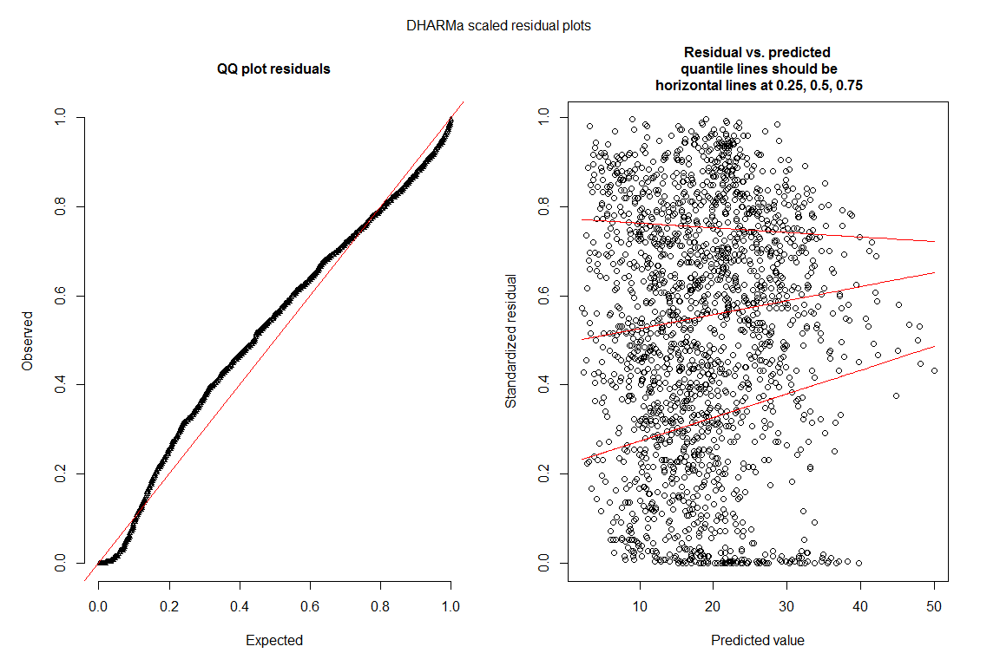<!-- -->

```r
plotResiduals(forests_df_t$winvar2000, simulationOutput$scaledResiduals, xlab = "MW elevation (2km)")
```

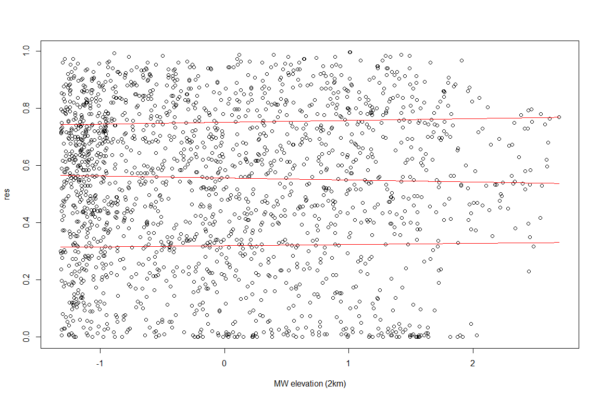<!-- -->

```r
plotResiduals(forests_df_t$elevvar, simulationOutput$scaledResiduals, xlab = "LS elevation")
```

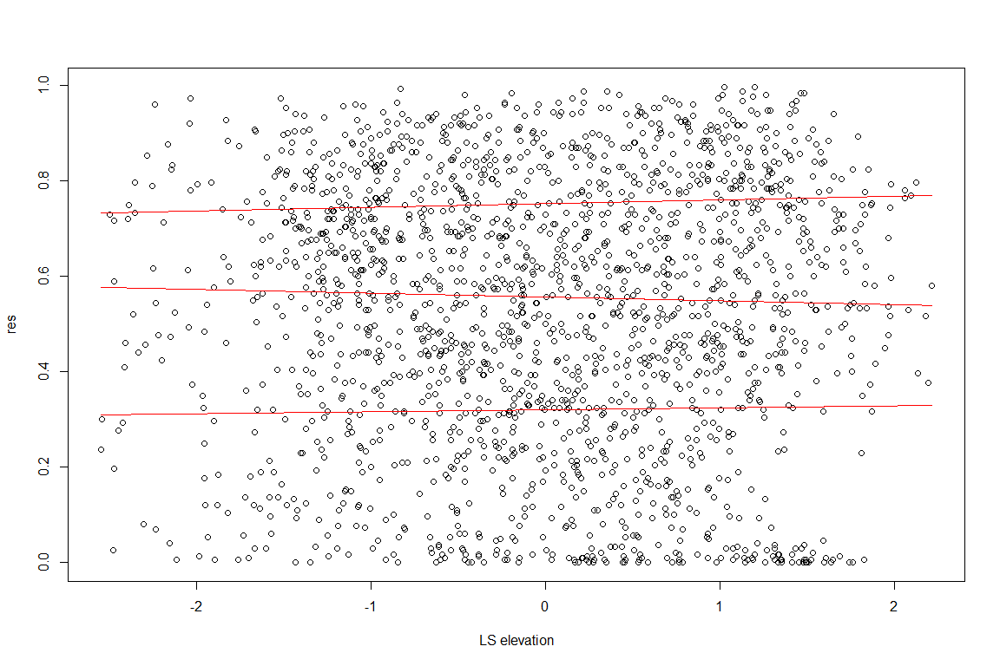<!-- -->

```r
plotResiduals(forests_df_t$elevmean, simulationOutput$scaledResiduals, xlab = "Mean elevation")
```

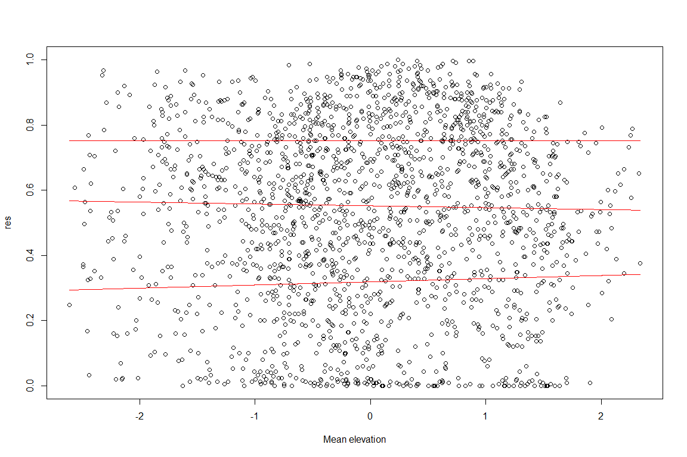<!-- -->

```r
plotResiduals(forests_df_t$bio1, simulationOutput$scaledResiduals, xlab = "Temperature")
```

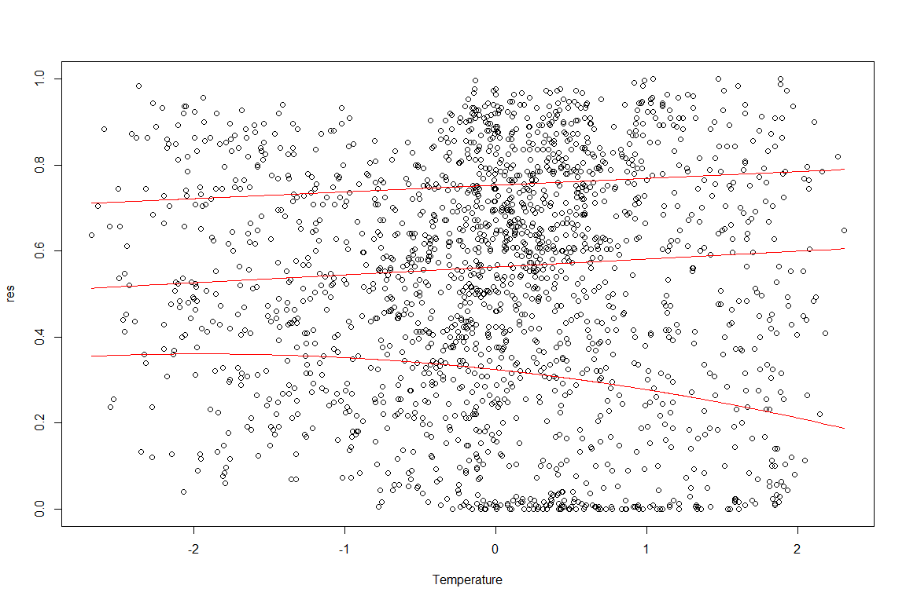<!-- -->

```r
plotResiduals(forests_df_t$bio12, simulationOutput$scaledResiduals, xlab = "Precipitation")
```

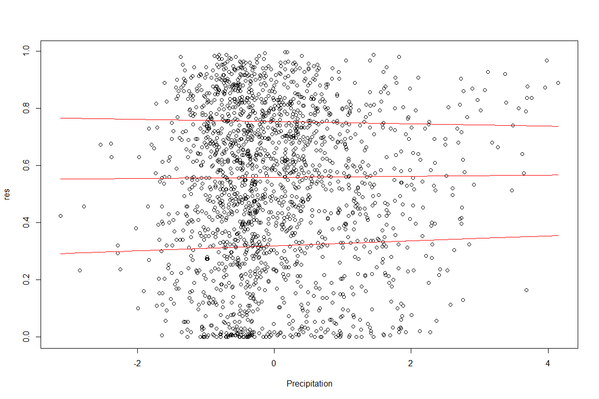<!-- -->

```r
plotResiduals(forests_df_t$bio15, simulationOutput$scaledResiduals, xlab = "Precipitation seasonality")
```

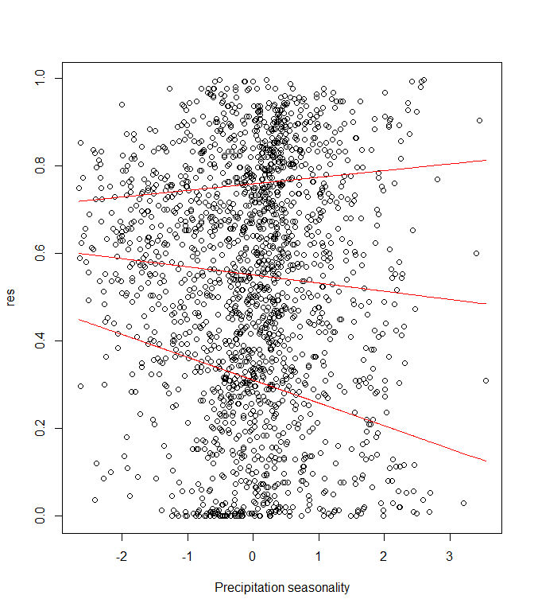<!-- -->

Based on the residual diagnostics, have gone with a negative binomial model due to overdispersion. The earlier version of the diagnostics also found patterns with temperature (bio1) and precipitation (bio12), hence the inclusion of their quadratic terms.

## Parsimonious model

This model is determined using stepwise selection. 


```r
mod_simple <- step(mod_global)
```

```
## Start:  AIC=13654.64
## sprich ~ elevmean + winvar2000 + elevvar + elevmean:winvar2000 + 
##     elevmean:elevvar + bio1 + I(bio1^2) + bio12 + I(bio12^2) + 
##     bio15
## 
##                       Df Deviance   AIC
## <none>                     2066.1 13655
## - bio12                1   2071.0 13658
## - elevmean:elevvar     1   2077.9 13664
## - elevmean:winvar2000  1   2081.2 13668
## - I(bio12^2)           1   2141.2 13728
## - bio1                 1   2154.8 13741
## - bio15                1   2183.0 13770
## - I(bio1^2)            1   2424.4 14011
```

```r
res_simple <- mod_simple %>% coef %>% enframe(name = "variable", value = "coef") %>%
  left_join(mod_global %>% confint %>% as_tibble(rownames = "variable")) %>%
  mutate(fvariable = factor(variable, levels = coefforder, labels = gsub("\n", " ", coefflabel))) %>%
  arrange(fvariable)
```

```
## Waiting for profiling to be done...
```

```
## Joining, by = "variable"
```

```r
simplep <- glance(mod_simple)$p.value
simpler2 <- glance(mod_simple)$r.squared

res_simple %>% select(fvariable, coef, `2.5 %`, `97.5 %`) %>% kable(digits=3)
```


fvariable                          coef    2.5 %   97.5 %
------------------------------  -------  -------  -------
(Intercept)                       3.114    3.072    3.157
MW elevation                     -0.233   -0.354   -0.112
LS elevation                      0.273    0.152    0.394
Mean elevation                    0.180    0.127    0.233
Mean elevation : MW elevation     0.227    0.113    0.342
Mean elevation : LS elevation    -0.195   -0.306   -0.084
Temperature                       0.148    0.117    0.179
Precipitation                     0.046    0.005    0.086
Precipitation seasonality        -0.159   -0.188   -0.130
Temperature (quadratic)          -0.245   -0.271   -0.220
Precipitation (quadratic)        -0.078   -0.095   -0.061

Full model retained. 

## Model average in MMI framework

Now to get the model averaged and variable importance estimates. We are using `dredge` to get the full list of models, then `model.avg` to get the estimates for the 95% confidence set. 


```r
mod_mmi <- dredge(mod_global, beta = "none") %>% 
  model.avg(subset = cumsum(weight) <= 0.95)

# mmi averaged estimates
res_mmi <- mod_mmi %>% coef %>% enframe(name = "variable", value = "coef") %>%
  left_join(mod_mmi %>% confint %>% as_tibble(rownames = "variable")) %>%
  left_join(mod_mmi %>% importance %>% enframe(name = "variable", value = "importance")) %>% 
  mutate(fvariable = factor(variable, levels = coefforder, labels = gsub("\n", " ", coefflabel))) %>%
  arrange(fvariable)

res_mmi %>% select(fvariable, coef, `2.5 %`, `97.5 %`, importance) %>% kable(digits = 3, caption = "Results of model averaging")
```

Only the global model was contained within the 95% confidence set, therefore all variables were determined to be of equal importance. 

# Plots and summary of main results

MW elevation and LS elevation had a similar absolute effect size based on the partial regression coefficients. However, MW elevation had a negative effect on species richness, whereas for LS elevation it was positive. This suggests that topographic variation has different effects on tree species richness depending on the scale at which it is measured. The interaction between mean elevation and MW elevation was positive, and present in all supported models. This suggests that effect of local-scale topographic variation is positive at high altitudes, but negative at low altitudes. The opposite is true of LS elevation, although this interaction term is not as strong.


```r
# This function lets us calculate the coefficient estimate and 95% CI for one
# variable at a particular value of the other variable in an interaction
calc_estci <- function(mod, variable1, variable2, value) {
  mod <- get(mod)
  slope <- coef(mod)[variable1]
  # catch it so either order will work
  int_slope <- coef(mod)[paste0(variable1, ":", variable2)]
  if(is.na(int_slope)) {
    int_slope <- coef(mod)[paste0(variable2, ":", variable1)]
  }
  var1 <- vcov(mod)[variable1, variable1]
  var2 <- vcov(mod)[variable2, variable2]
  cov_int <- vcov(mod)[variable1, variable2]
  UCI <- (slope + int_slope * value) + (1.9602 * sqrt(var1 + (2 * value * cov_int) + ((value^2) * var2)))
  LCI <- (slope + int_slope * value) - (1.9602 * sqrt(var1 + (2 * value * cov_int) + ((value^2) * var2)))
  y <- (slope + int_slope * value)
  return(tibble(coef = y, `2.5 %` = LCI, `97.5 %` = UCI))
}

# The first line creates a dataframe of the variables to calculate interaction for
figure1_df <- tibble(mod = "mod_global", 
                     variable1 = c(rep("winvar2000", 2), rep("elevvar", 2)),
                     variable2 = "elevmean", value = c(-1, 1, -1, 1)) %>%
  bind_cols(pmap_df(., calc_estci)) %>%
  inner_join(tibble(value = c(-1, 1), type = c("low", "high"))) %>%
  select(variable = variable1, type, coef, `2.5 %`, `97.5 %`) %>% 
  bind_rows(res_global %>% mutate(type = "mean") %>% select(-fvariable)) %>%
  filter(variable != "(Intercept)") %>%
  filter(!str_detect(variable, "elevmean:")) %>%
  mutate(variable = factor(variable, levels = coefforder, labels = coefflabel),
         type = factor(type, levels = c("low", "mean", "high"))) %>%
  na.omit

pd <- position_dodge(0.5)

forest_figure <- ggplot(figure1_df, aes(x = variable, y = coef, colour = type)) + 
  geom_errorbar(aes(ymin=`2.5 %`, ymax=`97.5 %`, colour = type), width=0.2, position=pd) +
  geom_point(position = pd) +
  scale_color_manual(values = c("grey", "black", "grey")) +
  geom_hline(yintercept = 0, linetype = "dotted") + 
  ylab(expression(paste("Coefficient estimate " %+-% " 95% CI"))) + 
  xlab("") + theme(legend.position = "none")

forest_figure
```

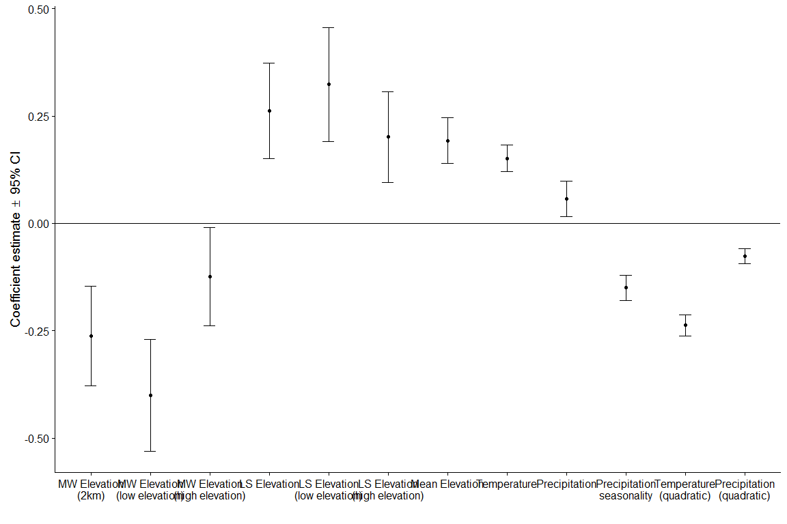<!-- -->

```r
save(forest_figure, file = "results/forest_res_figure.Rda")
```
