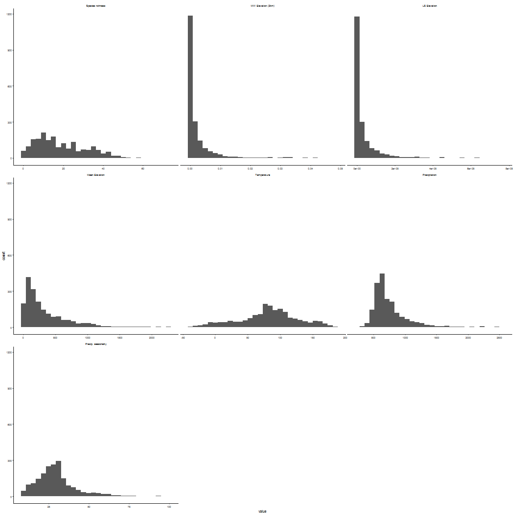

# Upscaling: Forest Case Study
Laura Graham  


# Data

## EU forest data

First we need to load in and spatialise the EU forest data. These are data from @Mauri2017. Available for dowload on [figshare](https://ndownloader.figshare.com/files/6662535)


## Environmental data

The data to be upscaled are the elevation data from the [European Environment Agency](https://www.eea.europa.eu/data-and-maps/data/eu-dem). Note that these are in a specific European projection: European Grid: ETRS89-LAEA. All other datasets will be transformed to this projection. By cropping all datasets to the extent of the EU elevation data, we end up losing some of the data from the EU forest dataset, such as the records from Northern Africa and the Canaries. We aggregate the elevation to 100m (from 25m) both for ease of computation and *is there a biological reason??* - also characteristic scale of variation? doesn't really change visually much from 25m to 100m - need to do some kind of test to make sure this simplification if valid. 

We will use the moving window to upscale the variation in elevation at three scales: 500 m, 1 km, 2 km. We do not have *a priori* expectation of the appropriate scale of effect, but we do have reason to expect that variation in elevation will determine species richness due to the opening up of niche space [citations]. We will also calculate variation in elevation at the 0.5 degree scale. As covariates, to avoid confounding variables, we will calculate average temperature and precipitation at the 0.5 degree scale. 


## Exploration and transformation

What do the variables look like spatially?

<!-- -->

what are the minimum and maximum values? 


variable                   min          max
--------------------  --------  -----------
Species richness         1.000       74.000
MW Elevation (2km)       0.000        0.048
LS Elevation             1.501   763758.375
Mean Elevation          -2.896     2258.162
Temperature            -37.496      185.708
Precipitation          273.281     2576.416
Precip. seasonality      7.995       98.268

How are the variables distributed?

<!-- -->

Species richness ideal for Poisson distribution, right skew to MW Elevation and LS elevation, Mean elevation, as well as the precipitation variables. 

And where are the correlations?

<!-- -->

Not so great. WB Elevation is the lowest correlation except for total precipitation (bio12). Highest correlation is with precipitation seasonality (bio15). Our expectation that variation in elevation would be important is supported here by the fact that the species richness correlation with mean elevation is lower. 

Note that I chose 2 km because it made sense, but when doing this with other window sizes, there was not much difference between the correlation values. I wonder about using a larger window size here. Need to look up some biological reasoning behind the scale. 
<!-- -->

Better, stick with this for now. It's fine because we don't need to interpret these coefficients. 

Now scale the data (mean = 0, sd = 1) so that the partial regression coefficients are comparable. 


# Models

## Global model

We are including the quadratic term for temperature (bio1) and precipitation (bio12), due to the shape of the relationship between these variables (based on some of the residual diagnostics
)

fvariable                          coef    2.5 %   97.5 %
------------------------------  -------  -------  -------
(Intercept)                       3.067    3.020    3.115
MW elevation                     -0.262   -0.378   -0.147
LS elevation                      0.262    0.151    0.374
Mean elevation                    0.193    0.140    0.246
Mean elevation : MW elevation     0.139    0.066    0.212
Mean elevation : LS elevation    -0.061   -0.130    0.008
Temperature                       0.152    0.121    0.183
Precipitation                     0.058    0.016    0.099
Precipitation seasonality        -0.150   -0.179   -0.120
Temperature (quadratic)          -0.237   -0.263   -0.212
Precipitation (quadratic)        -0.077   -0.094   -0.059

So this is weird. Despite the correlation being super low, winvar2000 is the most important variable in the regression. Interestingly there is a negative effect of local-scale (2km) variation in elevation (WB Elevation), but a positive effect of landscape-scale (~50km) variation in elevation (LS Elevation). 

This model explains 40.99% of the deviance in tree species richness. This was calculated using D-squared [@Guisan2000a]. 

Check the model specification using the DHARMa package [@Hartig2017]. 

<!-- --><!-- --><!-- --><!-- --><!-- --><!-- --><!-- -->

Based on the residual diagnostics, have gone with a negative binomial model due to overdispersion. The earlier version of the diagnostics also found horrible patterns with temperature (bio1) and precipitation (bio12), hence the inclusion of their quadratic terms. It's still not ideal, but it's much better now. The range for this model is also off (2 - 50, instead of 1 - 74). 

## Parsimonious model

This model is determined using stepwise selection. 


```
## Start:  AIC=13737.94
## sprich ~ elevmean + winvar2000 + elevvar + elevmean:winvar2000 + 
##     elevmean:elevvar + bio1 + I(bio1^2) + bio12 + I(bio12^2) + 
##     bio15
## 
##                       Df Deviance   AIC
## <none>                     2078.5 13738
## - elevmean:elevvar     1   2081.5 13739
## - bio12                1   2086.1 13744
## - elevmean:winvar2000  1   2092.4 13750
## - I(bio12^2)           1   2149.6 13807
## - bio1                 1   2170.6 13828
## - bio15                1   2177.8 13835
## - I(bio1^2)            1   2413.3 14071
```

```
## Waiting for profiling to be done...
```

```
## Joining, by = "variable"
```


fvariable                          coef    2.5 %   97.5 %
------------------------------  -------  -------  -------
(Intercept)                       3.067    3.020    3.115
MW elevation                     -0.262   -0.378   -0.147
LS elevation                      0.262    0.151    0.374
Mean elevation                    0.193    0.140    0.246
Mean elevation : MW elevation     0.139    0.066    0.212
Mean elevation : LS elevation    -0.061   -0.130    0.008
Temperature                       0.152    0.121    0.183
Precipitation                     0.058    0.016    0.099
Precipitation seasonality        -0.150   -0.179   -0.120
Temperature (quadratic)          -0.237   -0.263   -0.212
Precipitation (quadratic)        -0.077   -0.094   -0.059

Full model retained. 

## Model average in MMI framework

Now to get the model averaged and variable importance estimates. We are using `dredge` to get the full list of models, then model.avg to get the estimates for the 95% confidence set. 


Table: Results of model averaging

fvariable                          coef    2.5 %   97.5 %   importance
------------------------------  -------  -------  -------  -----------
(Intercept)                       3.064    3.016    3.112           NA
MW elevation                     -0.272   -0.385   -0.159    1.0000000
LS elevation                      0.274    0.164    0.385    1.0000000
Mean elevation                    0.194    0.143    0.245    1.0000000
Mean elevation : MW elevation     0.116    0.036    0.197    1.0000000
Mean elevation : LS elevation    -0.061   -0.129    0.006    0.6152004
Temperature                       0.150    0.119    0.181    1.0000000
Precipitation                     0.060    0.020    0.099    1.0000000
Precipitation seasonality        -0.150   -0.180   -0.120    1.0000000
Temperature (quadratic)          -0.236   -0.262   -0.211    1.0000000
Precipitation (quadratic)        -0.077   -0.094   -0.059    1.0000000

# Plots and summary of main results

The window-based elevation measure was included in all supported models (summed Akaike weight = 1, as was the landscape elevation measure (summed Akaike weight = 1). MW elevation and LS elevation had a similar absolute effect size based on the partial regression coefficients. However, WB elevation had a negative effect on species richness, whereas for LS elevation it was positive. This suggests that topographic variation has different effects on tree species richness depending on the scale at which it is measured (I wonder why this is??). The interaction between mean elevation and MW elevation was positive, and present in all supported models. This suggests that effect of local-scale topographic variation is positive at high altitudes, but negative at low altitudes. The opposite is true of LS elevation, although this interaction term is not as strong, and was not present in all supported models (summed Akaike weight = 0.62)

<!-- -->

# References
