# Upscaling: Jay Case Study


# Data

## Relative abundance index

First we need to load in and spatialise the Jay (*Garrulus glandarius*) data. These were provided by Simon Gillings at the BTO. The data includes the relative abundance indices for the 1990 Atlas (index90) and for the 2010 Atlas (index10). 


## Environmental data

The data for which we want to use the upscaling approach on is Land Cover Map 2007 [@Morton2011], which is the closest match to the 2010 relative abundance index for jays. We will use the moving window to upscale diversity of the two used habitats: Broadleaf and Coniferous forest (LCM codes 1, 2). Eurasian jays use a combination of these habitats: broadleaf for foraging, coniferous for nesting [@Hougner2005; @Holden2006]. We will calculate Shannon Diversity on just these two habitats to create a measure of the landscape structure used by jays. We will calculate Shannon diversity using the moving window approach at the 1km scale [needs citation] and without the moving window at the 10km scale. As covariates, to avoid confounding variables, we will calculate forest (habitat) cover percentage, urban land cover percentage and from Worldclim the following bioclimatic variables at the 10km scale: temperature (bio1), temperature range (bio7), annual preciptation (bio12) and precipitation seasonality (bio15). 


## Exploration and transformation

We need to first remove cells with 0 abundance - these cause issues with the model fit and we are only really interested in predicting abundance presuming the species is present. Why are zeroes more complicated? Potential discussion point... 

What do the variables look like spatially?

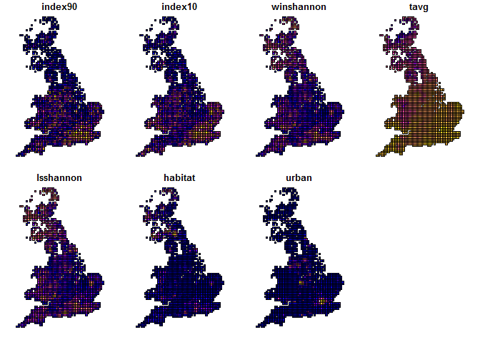<!-- -->

What are the minimum and maximum values? 


variable                     min       max
-----------------------  -------  --------
Abundance (1990 Atlas)     0.000     1.000
Abundance (2010 Atlas)     0.027     1.000
MW Shannon                 0.004     0.893
LS Shannon                 0.005     1.019
Forest %                   0.000     0.752
Urban %                    0.000     0.875
Temperature               43.000   109.000

Bit worrying that the maximum value for landscape-Shannon is (slightly) above 1... Need to go back and check, but it generally looks about right otherwise. 

How are the variables distributed?

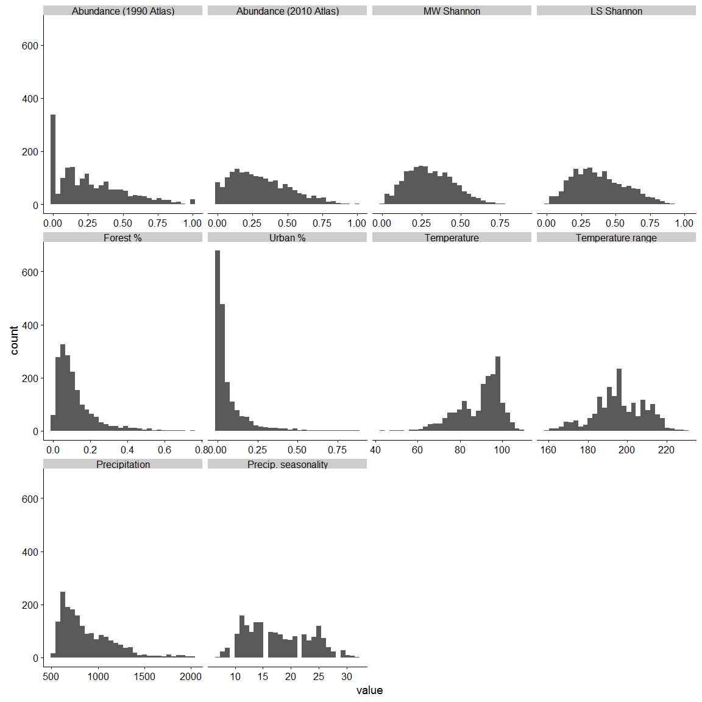<!-- -->

Lots of zeros in the 1990 index. Likely that this is more to do with surveyed cells than actual abundances. Start with the 2010 Atlas, then if we move to look at comparison we might want to think of removing zero rows (or rows which are not zero in both 2010 and 1990). 

Right skew to habitat percentage, urban percentage and precipitation, and left skew to temperature. 

And where are the correlations?

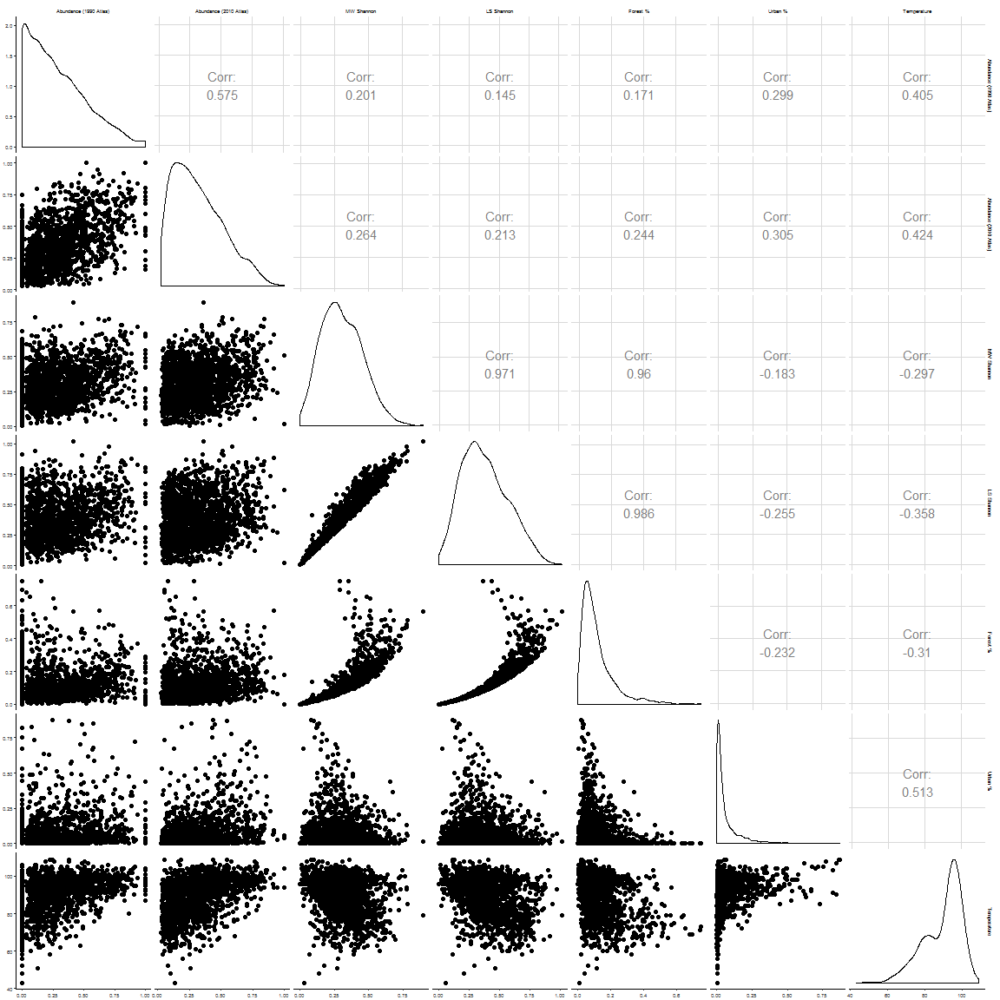<!-- -->

Good sign to start! Strongest correlate of both indices is temperature followed by the window-based Shannon measure. After that it's urban percentage, followed by the landscape-based Shannon measure, followed by percentage cover of habitat. Interestingly, although both Shannon measures correlate with the amount of habitat, the window-based measure is least correlated with this (still very high). The 0.9651416 between the two Shannon measures means we will have issues with Type II errors when we include both - need to remember this. One point about the 'high' (not really high, but relative to other predictors) correlation between urban percentage and jay abundance: this is potentially an observation thing, but also jays are becoming more associated with urban habitats [parks, cemetaries etc, see @Holden2006], so it may be a real effect. Anyway, it's worth including. 

Based on distributions (and some initial modeling not shown) need to transform the temperature, habitat and urban percentage variables. Additionally, because the abundance index is proportional, we transform this using a logit transform with the smallest non-zero value added to the numerator and denominator due to presence of 0 and 1 in data [@Warton2011]:

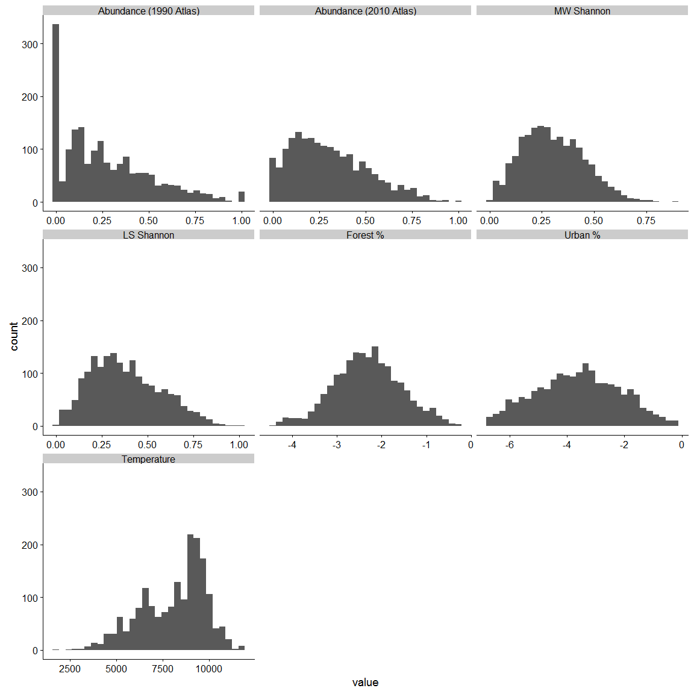<!-- -->

The abundance score for some cells was equal to 0, so the smallest non-zero percentage response (0.03) was added to the logit function.

Better, stick with this for now. It's fine because we don't need to interpret these coefficients. 

Now scale the data (mean = 0, sd = 1) so that the partial regression coefficients are comparable. 


# Models 

Following @Smith2011c we use three approaches to quantify the relative importance of the window-based Shannon measure over the more traditional landscape level measure (and habitat amount??): we compare the partial regression coefficients from a global model, the parsimonious model, and the model average of all supported models in a multi-model inference framework (MMI)

## Global model

This is the model which contains all predictors (window- and landscape-based Shannon measure, habitat amount, and the interaction between habitat amount and the two Shannon measures) and the additional covariates (urban cover and average temperature). 

I'm not currently sure about interactions... I think it is useful to include interactions between habitat amount and the two Shannon measures, but my worry here is that the main effect then becomes less interpretable [this was one of my concerns with @Smith2011c, although I think they dealt with it reasonably well]. 

<!---
I need to properly look into the error structure for the models, because it is proportion data and therefore bounded at 0, 1. For now am incorrectly using normal distribution see [Warton and Hui 2011](http://onlinelibrary.wiley.com/doi/10.1890/10-0340.1/full) for discussion of analysis of proportion data. Normal distribution can be problematic with ratio data unless numerator variance >> denominator variance. In our case, the denominator is always the same, so it should be fine to model with a normal distribution? My main concern is it looks much more like a Poisson distribution (or zero-inflated for 1990 index).

Have decided on binomial regression. The model fit seems much better (in terms of no departures from the assumptions).  
DELETE WHEN HAPPY TO
--->

Following @Warton2011, I have logit transformed the data (with the smallest non-zero value added to numerator and denominator to account for 0 and 1 in the data). The data will then be modelled using linear regression. This is because the proportions are not strictly binomial and therefore using a binomial error structure does not make sense. 


fvariable                  coef    2.5 %   97.5 %
----------------------  -------  -------  -------
Intercept                 0.026   -0.026    0.077
MW Shannon                0.283    0.071    0.494
LS Shannon               -0.035   -0.282    0.212
Forest %                  0.215    0.061    0.368
Forest % : MW Shannon    -0.010   -0.194    0.174
Forest % : LS Shannon    -0.017   -0.202    0.168
Urban %                   0.125    0.078    0.172
Temperature               0.497    0.449    0.546

First model looks to fit my expectation - partial regression coefficient for window-based Shannon is larger than the landscape-based Shannon coefficient, habitat (marginally) and the interaction terms. 

The model explains 36.75% of the variance in jay abundance. 

Need to check how terrible this model is:

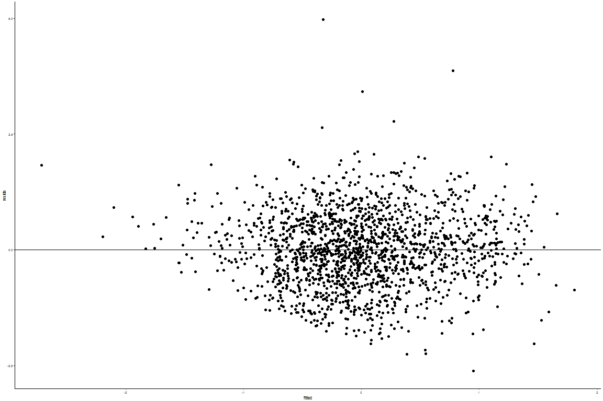<!-- -->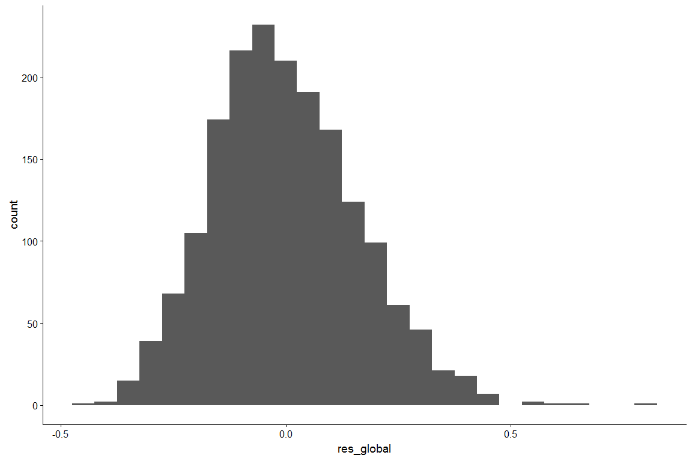<!-- -->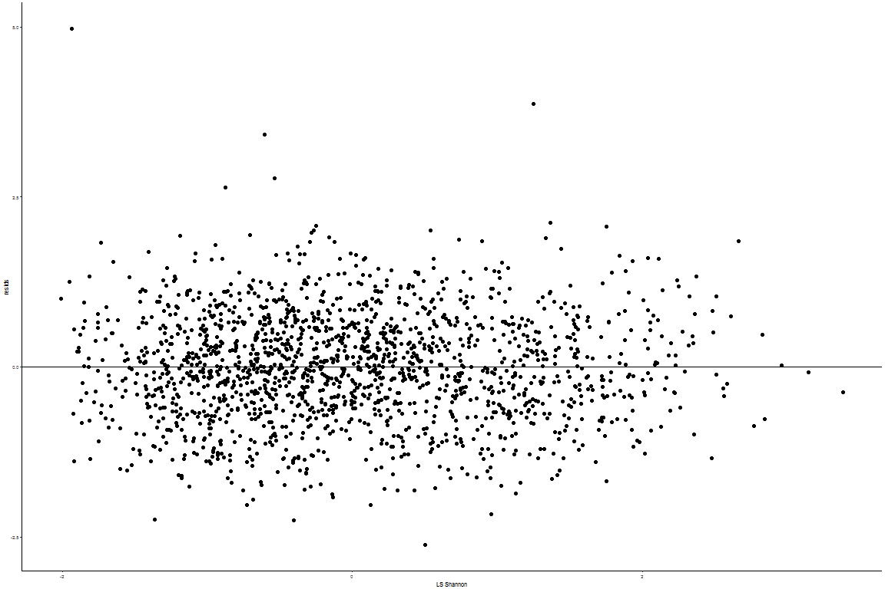<!-- -->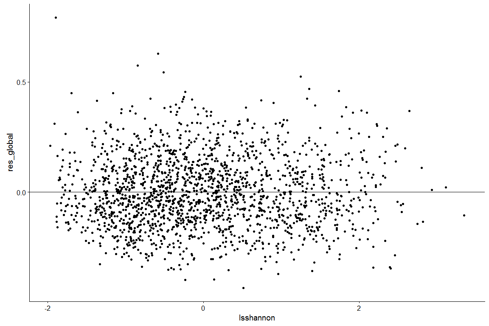<!-- -->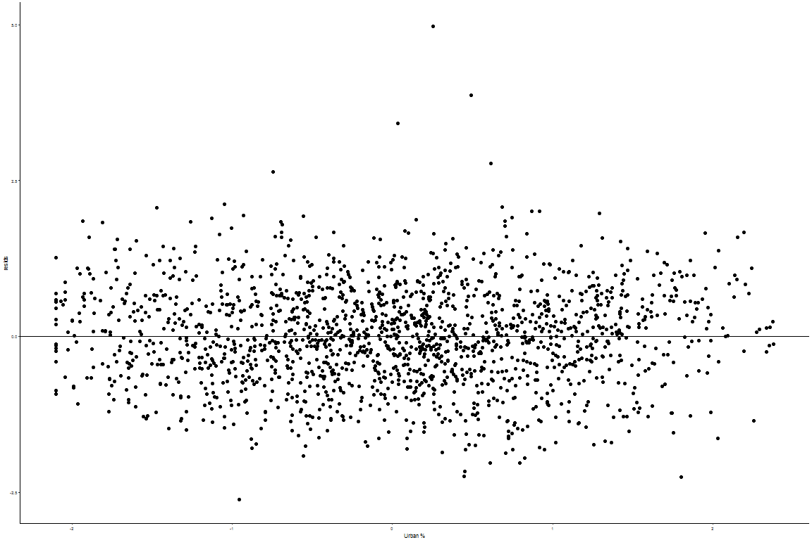<!-- -->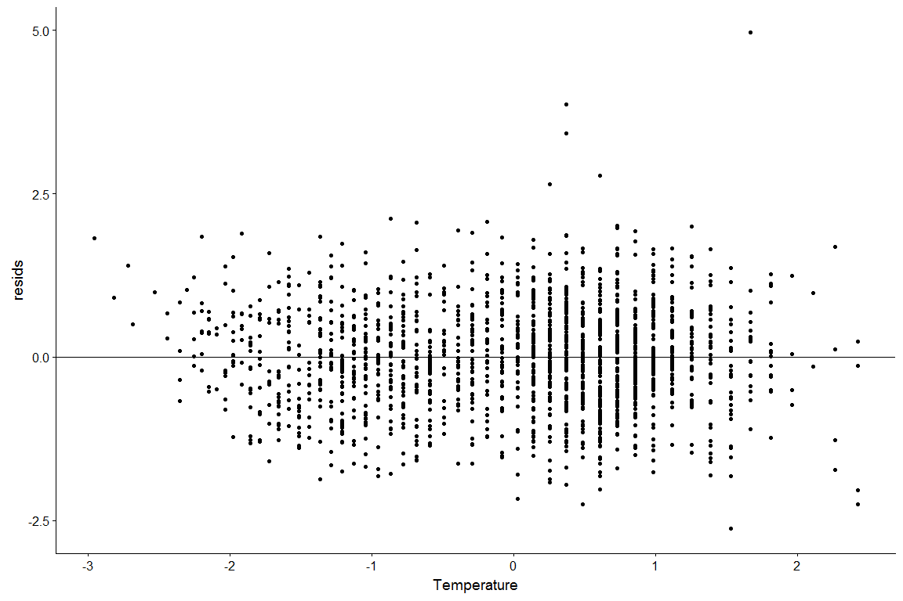<!-- -->

There is still some patterning in the residuals, but overall a reasonable model fit. The lowest fitted value is 0.06 and the highest is 0.86. Much better conformity to assumptions and range of predicted values than either the normal or binomial versions. 

## Parsimonious model

This model is determined using stepwise selection. 


```
## Start:  AIC=-772.5
## index10_logit ~ habitat + winshannon + lsshannon + urban + bio1 + 
##     habitat:lsshannon + habitat:winshannon
## 
##                      Df Sum of Sq    RSS     AIC
## - habitat:winshannon  1     0.007 1086.6 -774.49
## - habitat:lsshannon   1     0.021 1086.6 -774.47
## <none>                            1086.6 -772.50
## - urban               1    17.588 1104.2 -746.90
## - bio1                1   256.529 1343.1 -410.16
## 
## Step:  AIC=-774.49
## index10_logit ~ habitat + winshannon + lsshannon + urban + bio1 + 
##     habitat:lsshannon
## 
##                     Df Sum of Sq    RSS     AIC
## <none>                           1086.6 -774.49
## - habitat:lsshannon  1     1.343 1087.9 -774.37
## - winshannon         1     7.628 1094.2 -764.47
## - urban              1    17.689 1104.3 -748.73
## - bio1               1   260.927 1347.5 -406.53
```

```
## Joining, by = "variable"
```


fvariable                  coef    2.5 %   97.5 %
----------------------  -------  -------  -------
Intercept                 0.026   -0.026    0.077
MW Shannon                0.275    0.071    0.494
LS Shannon               -0.029   -0.282    0.212
Forest %                  0.217    0.061    0.368
Forest % : LS Shannon    -0.027   -0.202    0.168
Urban %                   0.125    0.078    0.172
Temperature               0.497    0.449    0.546

This model kicks out the interaction between Forest % and MW Shannon. Conclusions remain the same. This model explains 36.75% of the variance. 

Validation of this model: 

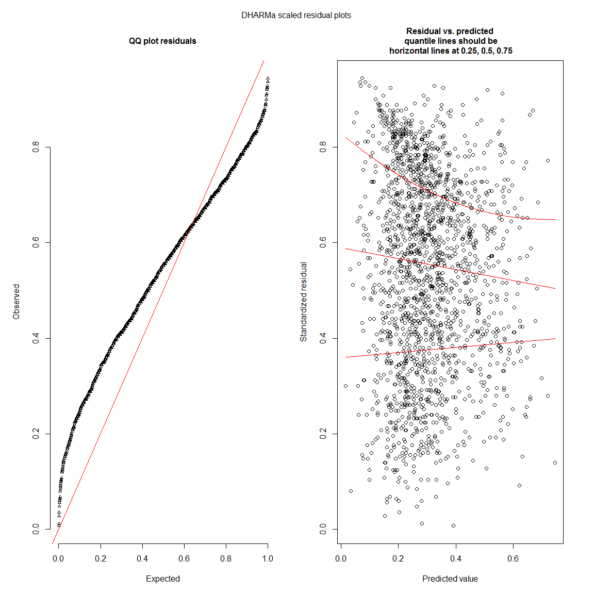<!-- --><!-- -->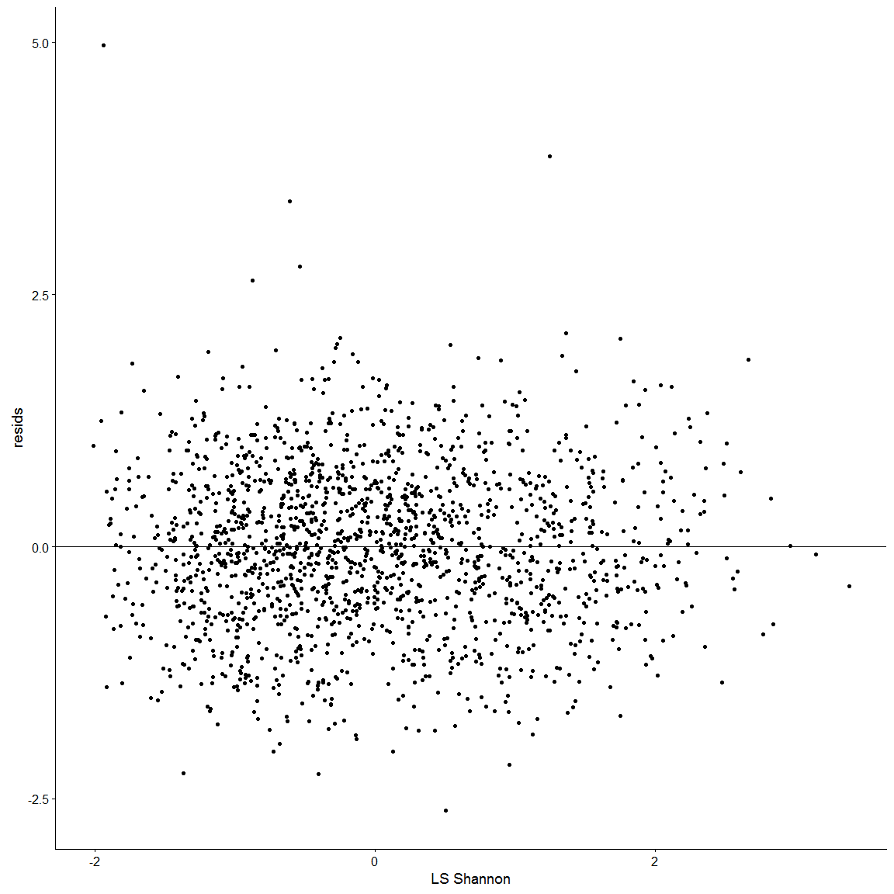<!-- -->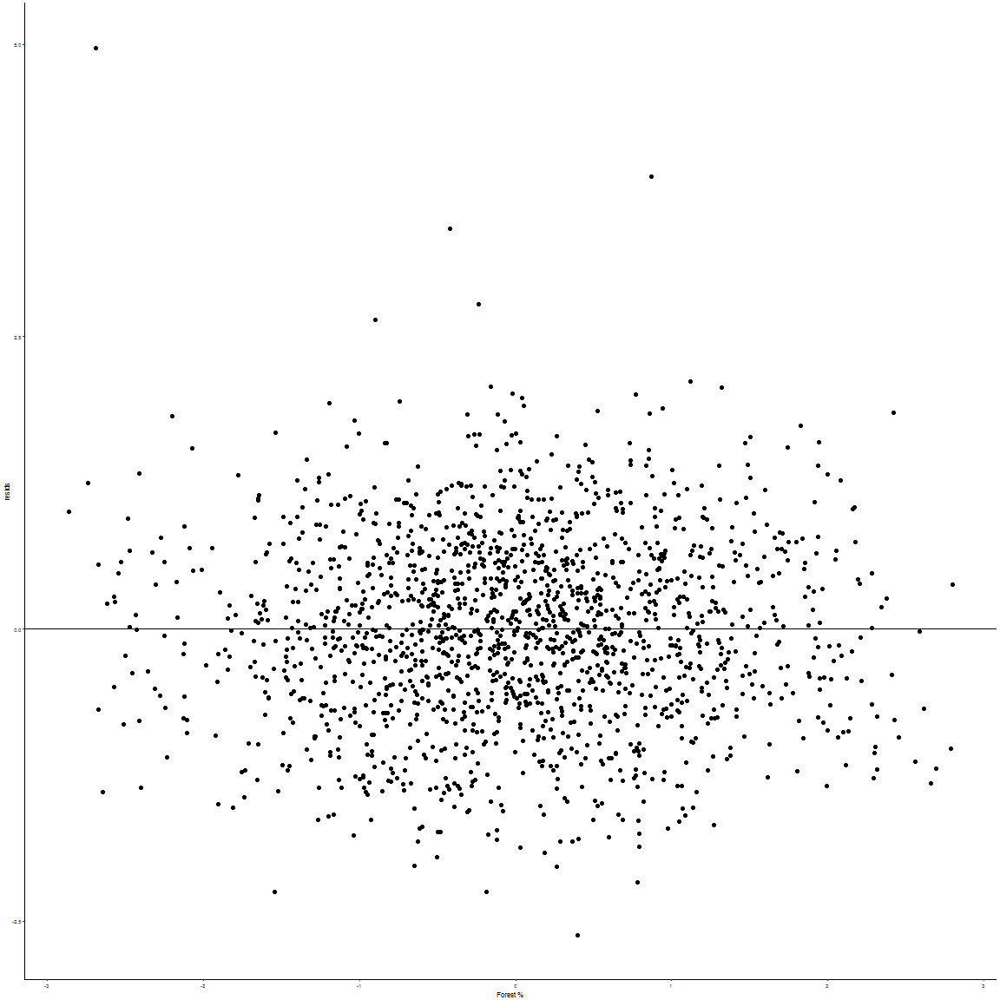<!-- -->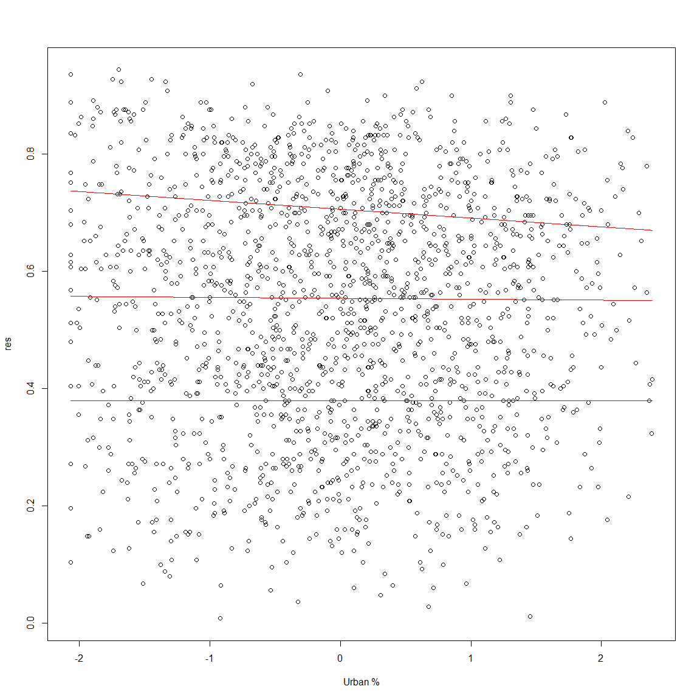<!-- -->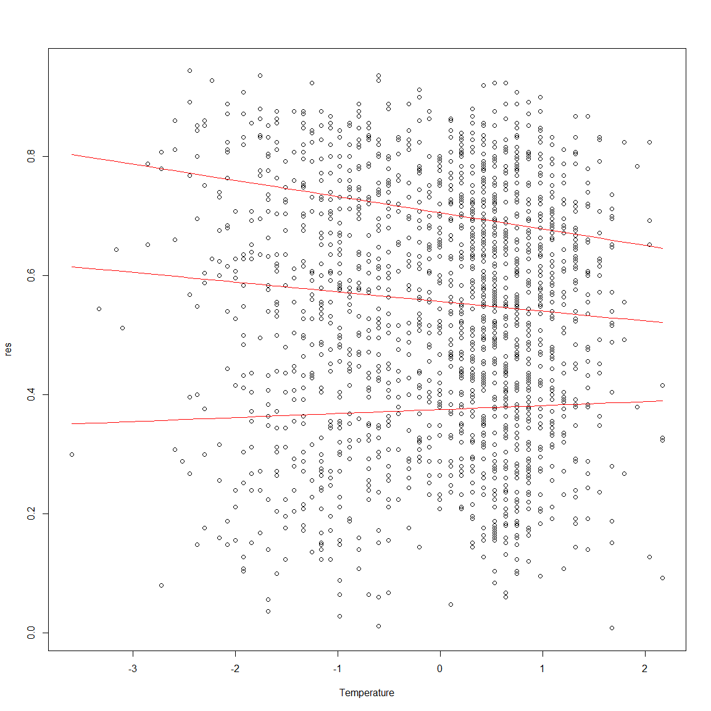<!-- -->

Residuals are better again. Lowest fitted value is 0.06 and the highest is 0.86.

## Model average in MMI framework

Now to get the model averaged and variable importance estimates. We are using `dredge` to get the full list of models, then model.avg to get the estimates for the 95% confidence set. 


Table: Results of model averaging

fvariable                 coef   2.5 %   97.5 %   importance
----------------------  ------  ------  -------  -----------
Intercept                 0.02   -0.04     0.07           NA
MW Shannon                0.27    0.14     0.41    1.0000000
LS Shannon               -0.06   -0.28     0.16    0.4215642
Forest %                  0.21    0.08     0.35    1.0000000
Forest % : MW Shannon    -0.03   -0.06     0.01    0.4963151
Forest % : LS Shannon    -0.03   -0.06     0.01    0.1434549
Urban %                   0.13    0.08     0.17    1.0000000
Temperature               0.50    0.45     0.55    1.0000000

Window-based Shannon measure again coming out as more important than the landscape-based version using both the model averaged partial regression coefficients and the sum of Akaike weights (importance in the above table). 

# Plots and summary of main results

The window-based Shannon measure was included in more supported models (summed Akaike weight = 1 than the landscape-based Shannon measure (summed Akaike weight = 0.42). The greater importance of the window-based measure is also demonstrated by its larger absolute effect and smaller confidence intervals in the global and mmi modelling approaches. LS Shannon was not present in the parsimonious modelling approach. Results for the global model are shown. 

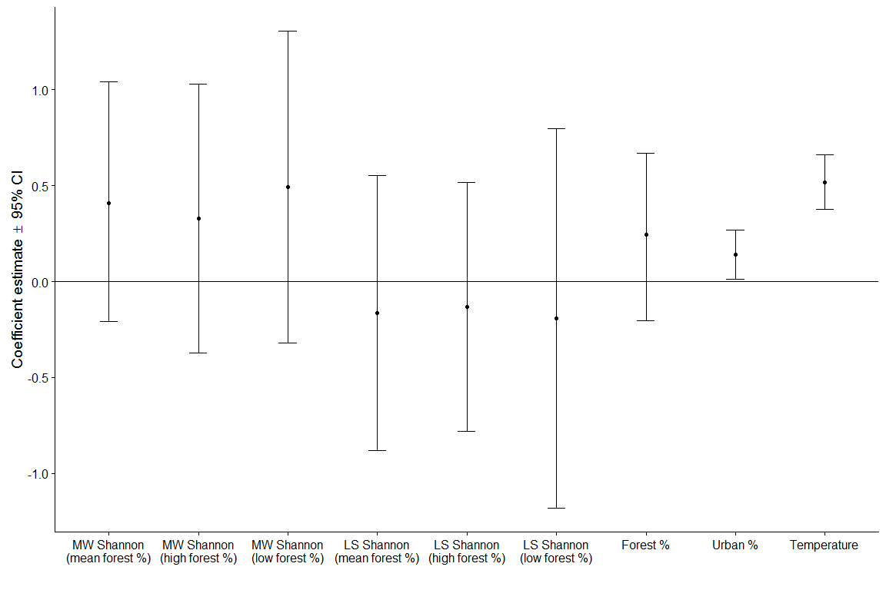<!-- -->

# References
