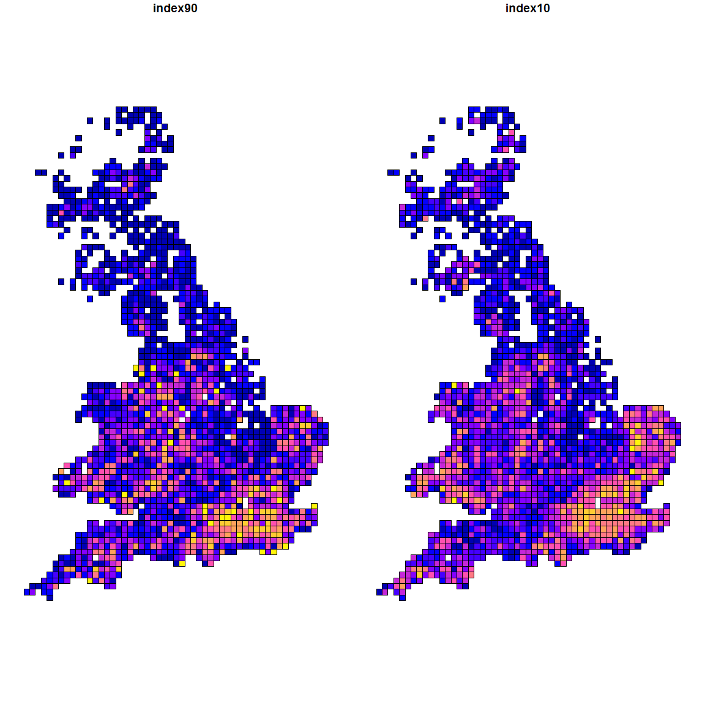

# Upscaling: Jay Case Study
Laura Graham  


# Case study 1: Jays

## Data

### Relative abundance index

First we need to load in and spatialise the Jay (*Garrulus glandarius*) data. These were provided by Simon Gillings at the BTO. The data includes the relative abundance indices for the 1990 Atlas (index90) and for the 2010 Atlas (index10). 


```r
jays <- read_sf("../DATA/bng/10km_grid_region.shp") %>% 
  rename(grid = TILE_NAME) %>% 
  inner_join(read_csv("../DATA/bto_jays/extract.csv") %>% 
               rename(grid = tenkm)) %>%
  select(index90, index10, geometry) %>%
  filter(!is.na(geometry))

plot(jays)
```

<!-- -->

### Environmental data

The data for which we want to use the upscaling approach on is Land Cover Map 2007 [@Morton2011], which is the closest match to the 2010 relative abundance index for jays. We will use the moving window to upscale diversity of the two used habitats: Broadleaf and Coniferous forest (LCM codes 1, 2). Eurasian jays use a combination of these habitats: broadleaf for foraging, coniferous for nesting [@Hougner2005; @Holden2006]. We will calculate Shannon Diversity on just these two habitats to create a measure of the landscape structure used by jays. We will calculate Shannon diversity using the moving window approach at the 1km scale [needs citation] and without the moving window at the 10km scale. As covariates, to avoid confounding variables, we will calculate forest (habitat) cover percentage, urban land cover percentage and average temperature at the 10km scale. 


```r
# This section only gets run the first time (or if changed) and the output saved
# to file. Set eval = FALSE at all other times.
lcm <- raster("../DATA/lcm/lcm2007_25m_gb.tif")
forest <- c(1, 2) # these are the two forest classes
urban <- c(22, 23)

# grid needs to be SpatialPolygonsDataFrame until I update the winmoveR package to use sf objects
bng <- as(jays, 'Spatial')

# shannon via moving window
bng$winshannon <- winmoveR::winmove_upscale(grid = bng, dat = lcm, radius = 1000, type = "rectangle", 
                                             fn = "diversity", lc_class = forest)

# shannon without moving window
bng$lsshannon <- nomove_upscale(grid = bng, dat = lcm, fn = "diversity", lc_class = forest)

habitat <- function(x, lc_class) {
  prop_class <- sum(as.matrix(x %in% lc_class)) / raster::ncell(x)
  return(prop_class)
}

bng$habitat <- nomove_upscale(grid = bng, dat = lcm, fn = "habitat", forest)
bng$urban <- nomove_upscale(grid = bng, dat = lcm, fn = "habitat", urban)

# might also be an idea to look at comparing to other fragstats measures (see notes on project sheet)

# temperature from worldclim
wc_bio <- getData('worldclim', var = 'bio', path = '../DATA/worldclim/', res=5)
tavg <- wc_bio[[1]]

bng_pts <- gCentroid(bng, byid=TRUE)
bng$tavg <- raster::extract(tavg, bng_pts)

# NB AT PRESENT I'M MISSING SOME TEMPERATURE VALUES - NEED TO SORT OUT THAT CODE
# (PROCEED THOUGH AS IT'S ONLY 24 POINTS) - I ACTUALLY THINK IT'S AT SLIGHTLY
# THE WRONG RESOLUTION TOO (5 MINUTES < 10KM ~ 9.2KM)...BETTER APPROACH WOULD BE
# TO RESAMPLE THE RASTER TO 10KM THEN EXTRACT.
jay_sp <- st_as_sf(bng) %>% na.omit
save(jay_sp, file="results/jays_covariates.Rda")
```

### Exploration and transformation

What do the variables look like spatially?


```r
load("results/jays_covariates.Rda")
plot(jay_sp)
```

<!-- -->

```r
# order variables by response, interested, covariate
jay_df <- tbl_df(jay_sp) %>% select(index90, index10, lsshannon, winshannon, habitat, urban, tavg)
```

what are the minimum and maximum values? 


```r
summarise_all(jay_df, funs(min, max) ) %>% 
  gather(variable, value) %>% 
  separate(variable, into = c("variable", "minmax"), sep="_") %>%
  spread(minmax, value) %>% select(variable, min, max) %>%
  mutate(variable = factor(variable, levels = varorder)) %>%
  arrange(variable) %>%
  kable(digits = 3)
```


variable         min       max
-----------  -------  --------
index90        0.000     1.000
index10        0.000     1.000
winshannon     0.004     0.893
lsshannon      0.005     1.019
habitat        0.000     0.752
urban          0.000     0.875
tavg          43.000   109.000

Bit worrying that the maximum value for landscape-Shannon is (slightly) above 1... Need to go back and check, but it generally looks about right otherwise. 

How are the variables distributed?


```r
jay_narrow <- gather(jay_df, variable, value) %>% 
  # order variables by response, interested, covariate
  mutate(variable = factor(variable, levels = varorder))
ggplot(jay_narrow, aes(x = value)) + 
  geom_histogram(bins = 30) + 
  facet_wrap(~variable, scales = "free_x")
```

<!-- -->

Lots of zeros in the 1990 index. Likely that this is more to do with surveyed cells than actual abundances. Start with the 2010 Atlas, then if we move to look at comparison we might want to think of removing zero rows (or rows which are not zero in both 2010 and 1990). 

Right skew to habitat percentage and urban percentage, and left skew to temperature. 

And where are the correlations?


```r
ggpairs(jay_df)
```

<!-- -->

Good sign to start! Strongest correlate of both indices is temperature followed by the window-based Shannon measure. After that it's urban percentage, followed by the landscape-based Shannon measure, followed by percentage cover of habitat. Interestingly, although both Shannon measures correlate with the amount of habitat, the window-based measure is least correlated with this (still very high). The 0.9649287 between the two Shannon measures means we will have issues with Type II errors when we include both - need to remember this. One point about the 'high' (not really high, but relative to other predictors) correlation between urban percentage and jay abundance: this is potentially an observation thing, but also jays are becoming more associated with urban habitats [parks, cemetaries etc, see @Holden2006], so it may be a real effect. Anyway, it's worth including. 

Based on distributions (and some initial modeling not shown) need to transform the temperature, habitat and urban percentage variables:


```r
# optimise to find optimal value for log transform
skew.score <- function(c, x) (skewness(log(x + c)))^2
c.habitat <- optimise(skew.score, c(0, 20), x = jay_df$habitat)$minimum
c.urban <- optimise(skew.score, c(0, 20), x = jay_df$urban)$minimum

jay_df_t <- mutate(jay_df, 
                   habitat = log(habitat + c.habitat),
                   urban = log(urban + c.urban), # zeros in the data
                   tavg = tavg^2)

jay_narrow_t <- gather(jay_df_t, variable, value) %>% 
  mutate(variable = factor(variable, 
         levels=c("index90", "index10", 
                  "lsshannon", "winshannon", 
                  "habitat", "urban", "tavg")))

ggplot(jay_narrow_t, aes(x = value)) + 
  geom_histogram(bins = 30) + 
  facet_wrap(~variable, scales = "free_x")
```

<!-- -->

Better, stick with this for now. It's fine because we don't need to interpret these coefficients. 

Now scale the data (mean = 0, sd = 1) so that the partial regression coefficients are comparable. 

```r
jay_df_t <- mutate_at(jay_df_t, .vars = vars(-index90, -index10), .funs = funs(scale))
```

## Models 

Using the approch outlined by [@Smith2009a; @Smith2011c] we use three approaches to quantify the relative importance of the window-based Shannon measure over the more traditional landscape level measure (and habitat amount??): we compare the partial regression coefficients from a global model, the parsimonious model, and the model average of all supported models in a multi-model inference framework (MMI)

### Global model

This is the model which contains all predictors (window- and landscape-based Shannon measure, habitat amount, and the interaction between habitat amount and the two Shannon measures) and the additional covariates (urban cover and average temperature). 

I'm not currently sure about interactions... I think it is useful to include interactions between habitat amount and the two Shannon measures, but my worry here is that the main effect then becomes less interpretable [this was one of my concerns with @Smith2011c, although I think they dealt with it reasonably well]. 

I need to properly look into the error structure for the models, because it is proportion data and therefore bounded at 0, 1. For now am incorrectly using normal distribution see [Warton and Hui 2011](http://onlinelibrary.wiley.com/doi/10.1890/10-0340.1/full) for discussion of analysis of proportion data. Normal distribution can be problematic with ratio data unless numerator variance >> denominator variance. In our case, the denominator is always the same, so it should be fine to model with a normal distribution? My main concern is it looks much more like a Poisson distribution (or zero-inflated for 1990 index).


```r
mod_global <- lm(index10 ~ habitat + winshannon + lsshannon + urban + tavg + habitat:lsshannon + habitat:winshannon, data = jay_df_t, na.action = na.fail)

res_global <- mod_global %>% coef %>% enframe(name = "variable", value = "coef") %>%
  left_join(mod_global %>% confint %>% as_tibble(rownames = "variable")) %>%
  mutate(variable = factor(variable, levels = coefforder)) %>%
  arrange(variable) 
globalp <- glance(mod_global)$p.value
globalr2 <- glance(mod_global)$r.squared

res_global %>% kable(digits=3)
```


variable                coef    2.5 %   97.5 %
-------------------  -------  -------  -------
(Intercept)            0.314    0.304    0.325
winshannon             0.054    0.012    0.097
lsshannon             -0.008   -0.057    0.042
habitat                0.052    0.022    0.083
habitat:winshannon     0.017   -0.020    0.053
habitat:lsshannon     -0.025   -0.062    0.012
urban                  0.027    0.018    0.036
tavg                   0.099    0.089    0.109

First model looks to fit my expectation - partial regression coefficient for window-based Shannon is significant and larger than the landscape-based Shannon coefficient, habitat (marginally) and the interaction terms. 

The model is significant (p < 0.001) and explains 37.8% of the variance in jay abundance. 

Need to check how terrible this model is:


```r
jay_df_t$res_global <- mod_global$residuals
jay_df_t$fit_global <- mod_global$fitted.values


ggplot(jay_df_t, aes(x = fit_global, y = res_global)) + geom_point()
```

<!-- -->

```r
ggplot(jay_df_t, aes(x = res_global)) + geom_histogram(binwidth = 0.05)
```

<!-- -->

It's quite bad. I think this is to do with using the normal distribution (we have negative predicted values, and no predicted values higher than 0.6605497). Need to work out the right distribution for this and check again. 

### Parsimonious model

This model is determined using stepwise selection. 


```r
mod_simple <- step(mod_global)
```

```
## Start:  AIC=-6570.94
## index10 ~ habitat + winshannon + lsshannon + urban + tavg + habitat:lsshannon + 
##     habitat:winshannon
## 
##                      Df Sum of Sq    RSS     AIC
## - habitat:winshannon  1    0.0208 46.607 -6572.1
## - habitat:lsshannon   1    0.0466 46.633 -6571.1
## <none>                            46.586 -6570.9
## - urban               1    0.8536 47.440 -6540.2
## - tavg                1   10.4435 57.030 -6208.5
## 
## Step:  AIC=-6572.13
## index10 ~ habitat + winshannon + lsshannon + urban + tavg + habitat:lsshannon
## 
##                     Df Sum of Sq    RSS     AIC
## <none>                           46.607 -6572.1
## - habitat:lsshannon  1    0.1389 46.746 -6568.8
## - winshannon         1    0.4806 47.088 -6555.6
## - urban              1    0.8402 47.447 -6541.9
## - tavg               1   10.7199 57.327 -6201.1
```

```r
res_simple <- mod_simple %>% coef %>% enframe(name = "variable", value = "coef") %>%
  left_join(mod_global %>% confint %>% as_tibble(rownames = "variable")) %>%
  mutate(variable = factor(variable, levels = coefforder)) %>%
  arrange(variable)
simplep <- glance(mod_simple)$p.value
simpler2 <- glance(mod_simple)$r.squared

res_simple %>% kable(digits = 3)
```


variable               coef    2.5 %   97.5 %
------------------  -------  -------  -------
(Intercept)           0.314    0.304    0.325
winshannon            0.068    0.012    0.097
lsshannon            -0.018   -0.057    0.042
habitat               0.049    0.022    0.083
habitat:lsshannon    -0.009   -0.062    0.012
urban                 0.027    0.018    0.036
tavg                  0.099    0.089    0.109

Again, the absolute value of the partial regression coefficient for the window-based Shannon measure is larger than the landscape-based version and habitat amount (as well as the interaction between the landscape based version and habitat amount). The model is significant (p < 0.001) and explains 37.77% of the variance in jay abundance. 

How bad is this one? 


```r
jay_df_t$res_simple <- mod_simple$residuals
jay_df_t$fit_simple <- mod_simple$fitted.values


ggplot(jay_df_t, aes(x = fit_simple, y = res_simple)) + geom_point()
```

<!-- -->

```r
ggplot(jay_df_t, aes(x = res_simple)) + geom_histogram(binwidth = 0.05)
```

<!-- -->

### Model average in MMI framework

Now to get the model averaged and variable importance estimates. We are using `dredge` to get the full list of models, then model.avg to get the estimates for the 95% confidence set. 


```r
mod_mmi <- dredge(mod_global, beta = "none") %>% 
  model.avg(subset = cumsum(weight) <= .95)

# mmi averaged estimates
res_mmi <- mod_mmi %>% coef %>% enframe(name = "variable", value = "coef") %>%
  left_join(mod_mmi %>% confint %>% as_tibble(rownames = "variable")) %>%
  left_join(mod_mmi %>% importance %>% enframe(name = "variable", value = "importance")) %>% 
  mutate(variable = factor(variable, levels = coefforder)) %>%
  arrange(variable)

res_mmi %>% kable(digits = 3, caption = "Results of model averaging")
```


Table: Results of model averaging

variable                coef    2.5 %   97.5 %   importance
-------------------  -------  -------  -------  -----------
(Intercept)            0.314    0.304    0.324           NA
winshannon             0.065    0.031    0.099    1.0000000
lsshannon             -0.018   -0.064    0.029    0.7260477
habitat                0.046    0.016    0.076    1.0000000
habitat:winshannon    -0.002   -0.032    0.028    0.6626935
habitat:lsshannon     -0.014   -0.042    0.013    0.5211279
urban                  0.027    0.018    0.036    1.0000000
tavg                   0.100    0.090    0.109    1.0000000

Window-based Shannon measure again coming out as more important than the landscape-based version using both the model averaged partial regression coefficients and the sum of Akaike weights (importance in the above table). 

## Plots and summary of main results

I might want to do a plot that shows each of the explanatory variables (or at least the jay abundance, MW Shannon and LS Shannon). 

The window-based Shannon measure was included in all supported models (summed Akaike weight = 1, whereas the landscape-based Shannon measure was not (summed Akaike weight = 0.73). The greater importance of the window-based measure is also demonstrated by its larger absolute effect and constant significance in all three modelling approaches (Figure xx). 


```r
# This function lets us calculate the coefficient estimate and 95% CI for one
# variable at a particular value of the other variable in an interaction
calc_estci <- function(mod, variable1, variable2, value) {
  mod <- get(mod)
  slope <- coef(mod)[variable1]
  # catch it so either order will work
  int_slope <- coef(mod)[paste0(variable1, ":", variable2)]
  if(is.na(int_slope)) {
    int_slope <- coef(mod)[paste0(variable2, ":", variable1)]
  }
  var1 <- vcov(mod)[variable1, variable1]
  var2 <- vcov(mod)[variable2, variable2]
  cov_int <- vcov(mod)[variable1, variable2]
  UCI <- (slope + int_slope * value) + (1.9602 * sqrt(var1 + (2 * value * cov_int) + ((value^2) * var2)))
  LCI <- (slope + int_slope * value) - (1.9602 * sqrt(var1 + (2 * value * cov_int) + ((value^2) * var2)))
  y <- (slope + int_slope * value)
  return(tibble(coef = y, `2.5 %` = LCI, `97.5 %` = UCI))
}

# The first line creates a dataframe of the variables to calculate interaction for
figure1_df <- tibble(mod = "mod_simple", variable1 = "lsshannon", 
                     variable2 = "habitat", value = c(-1, 1)) %>%
  bind_cols(pmap_df(., calc_estci)) %>%
  inner_join(tibble(value = c(-1, 1), type = c("_low", "_high"))) %>%
  mutate(variable = paste0(variable1, type)) %>%
  select(variable, coef, `2.5 %`, `97.5 %`) %>% 
  bind_rows(res_simple) %>%
  filter(variable != "(Intercept)") %>%
  select(variable, coef, `2.5 %`, `97.5 %`) %>%
  filter(!str_detect(variable, "habitat:")) %>%
  mutate(variable = factor(variable, levels = coefforder_noint, labels = coefflabel)) %>%
  na.omit
```

```
## Warning in bind_rows_(x, .id): binding character and factor vector,
## coercing into character vector
```

```r
pd <- position_dodge(1)

res_figure <- ggplot(figure1_df, aes(x = variable, y = coef)) + 
  geom_errorbar(aes(ymin=`2.5 %`, ymax=`97.5 %`), colour="black", width=0.2, position=pd) +
  geom_point(position = pd) +
  scale_color_viridis_d(name = "") +
  geom_hline(yintercept = 0) + 
  ylab(expression(paste("Coefficient estimate " %+-% " 95% CI"))) + 
  xlab("")

save_plot("figures/results_figure.png", res_figure, 
          base_width = 10, base_aspect_ratio = 1.3)
res_figure
```

<!-- -->

## References
