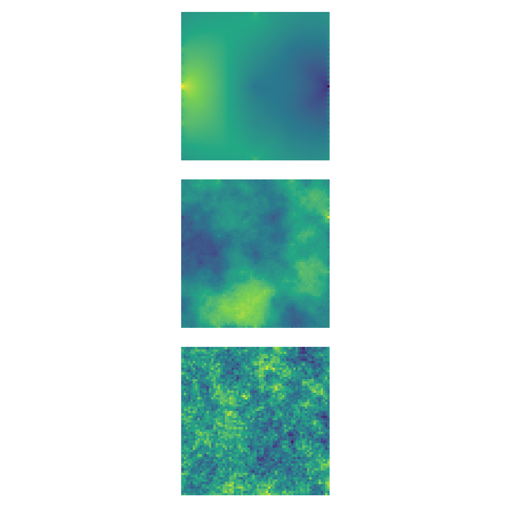
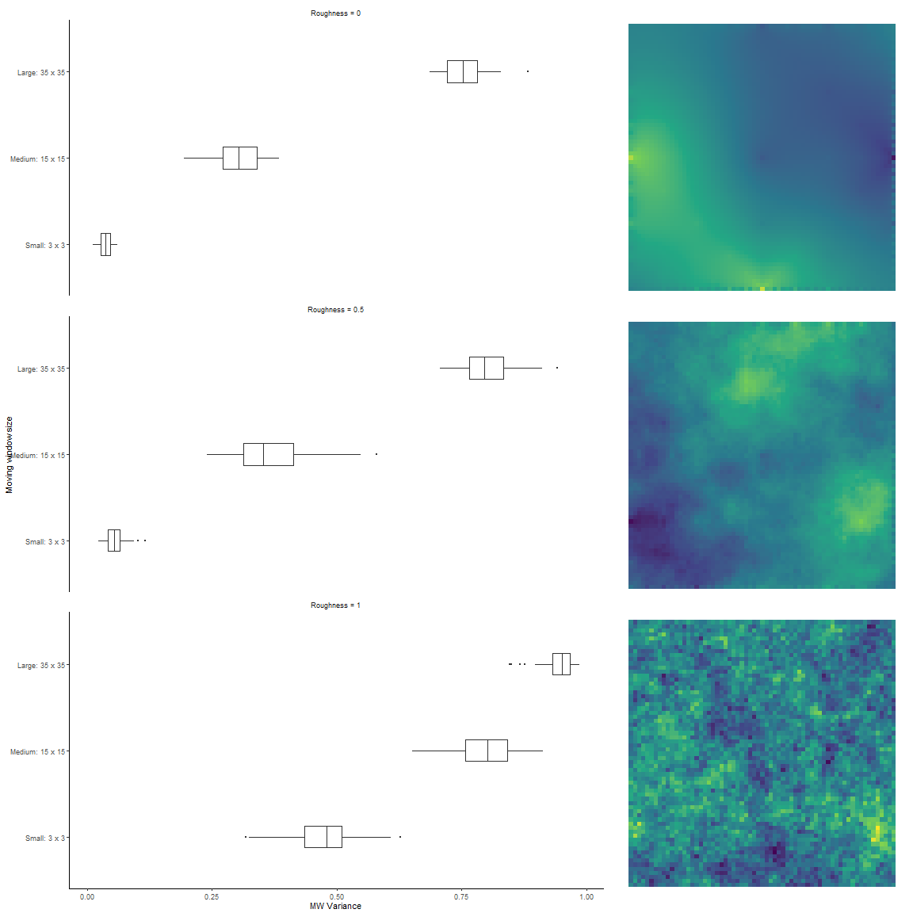
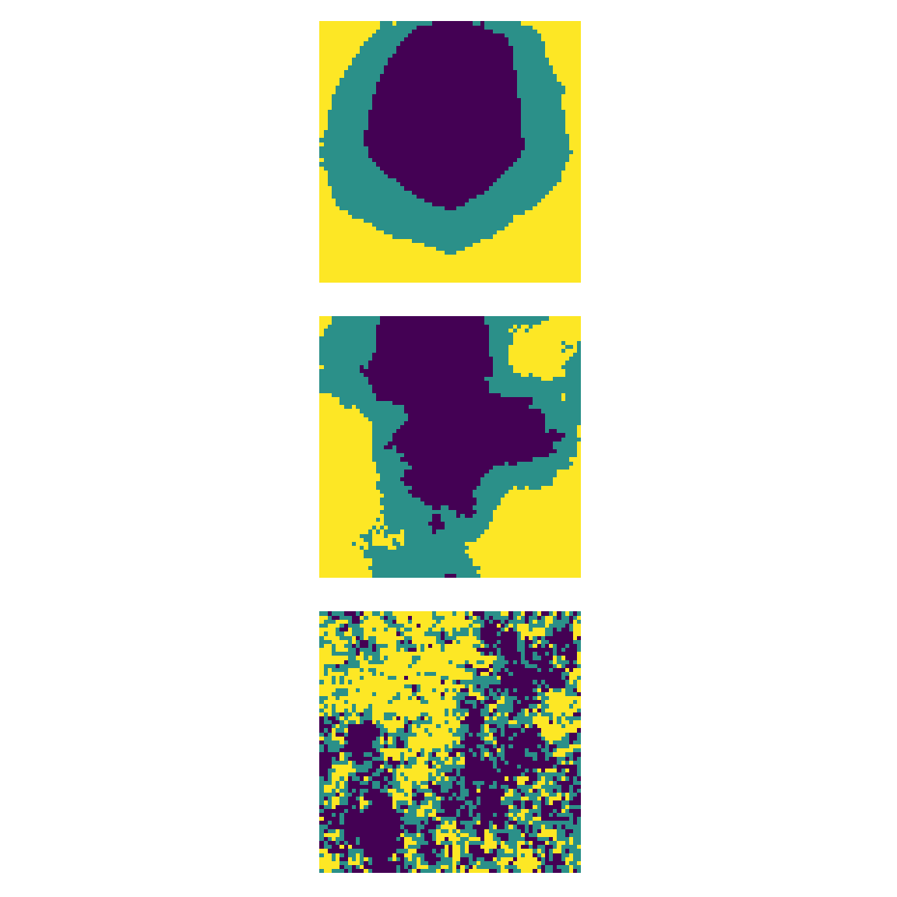
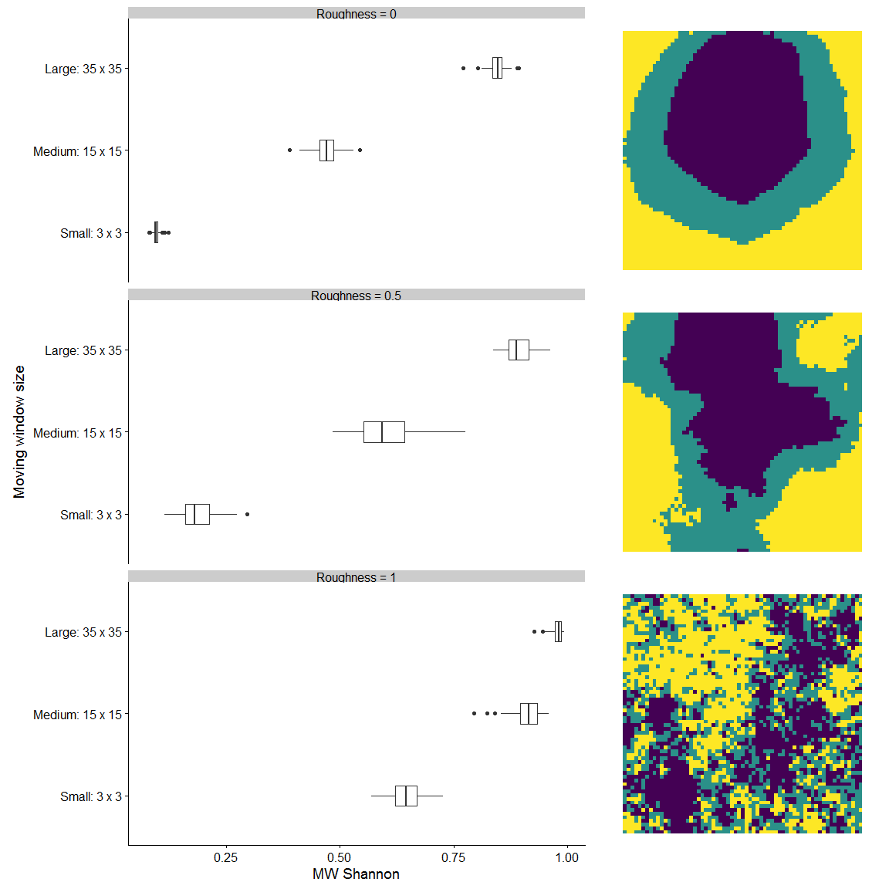

# Upscaling: Simulations

## Simulation One: continuous variables

This simulation shows the use of the moving window based spatial structure measure for continuous variables which have finer scale variation than the resolution of analysis. This could be, for example, topographic or microclimate variation. 

### Simulated landscapes

We simulated landscapes using the mid-point displacement method (`nlm_mpd`) from the `NLMR` package [@Sciaini2018]. We simulated landscapes with three levels of spatial autocorrelation, and 100 replicates for each of these. The spatial autocorrelation of the landscape is controlled by the `roughness` parameter where a value of zero is a clustered landscape, and a value of one is a rough landscape. We generated landscapes of 65 x 65 cells using roughness = 0, 0.5, 1. We scaled each landscape to have a mean of zero, and a variance of one in order to facilitate comparison between landscapes. 

<!-- -->

**Figure 1** Example landscapes of each level of roughness

### Use winmover function

We used the `winmove` function from the [`winmoveR`](https://github.com/laurajanegraham/winmoveR) package to gain a moving-window based variance of the continuous variable at 3 different window sizes: 3 x 3 = small; 15 x 15 = medium; 35 x 35 = large. The window sizes represent the appropriate scale of effect of the continuous variable on the response. 

### Results

<!-- -->

**Figure 2** Results of the moving window analysis of continuous variables for simulated landscapes. Variance within moving windows was calculated at three scales. Note that the landscape scale variance is 1 in all cases. 

## Simulation Two: categorical variables

This simulation will show the use of the moving window-based spatial structure measure for categorical variables which have finer scale variation than the resolution of analysis. This is appropriate for more classical landscape ecology questions about habitat structure. 

### Simulated landscapes

We will use the simulated landscapes from the previous example, and use the `util_classify` function to classify into equal proportions of three habitat types. This will give us a landscape scale Shannon evenness of 1 for all landscapes (complete evenness). 

<!-- -->

**Figure 3** Example categorical landscapes of each level of roughness

### Use winmover function

We used the `winmove` function from the [`winmoveR`](https://github.com/laurajanegraham/winmoveR) package to gain a moving-window based Shannon evenness of the categorical variable at 3 different window sizes: 3 x 3 = small; 15 x 15 = medium; 35 x 35 = large. The window sizes represent the appropriate scale of effect of the continuous variable on the response. 

### Results

<!-- -->

**Figure 4** Results of the moving window analysis of categorical variables for simulated landscapes. Shannon evenness within moving windows was calculated at three scales. Note that the landscape scale variance is 1 in all cases. 

## References
